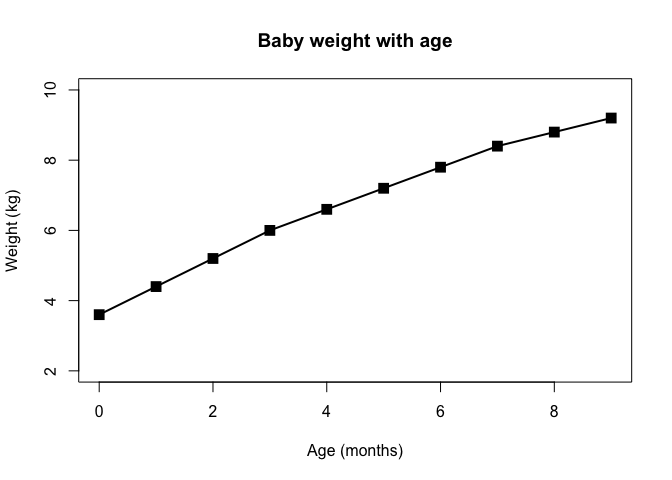
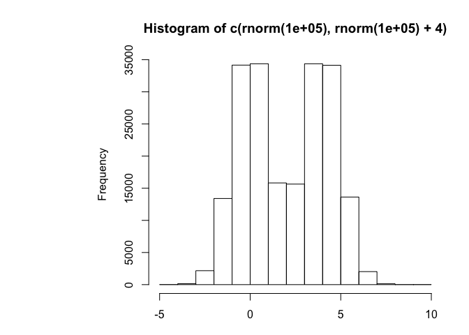
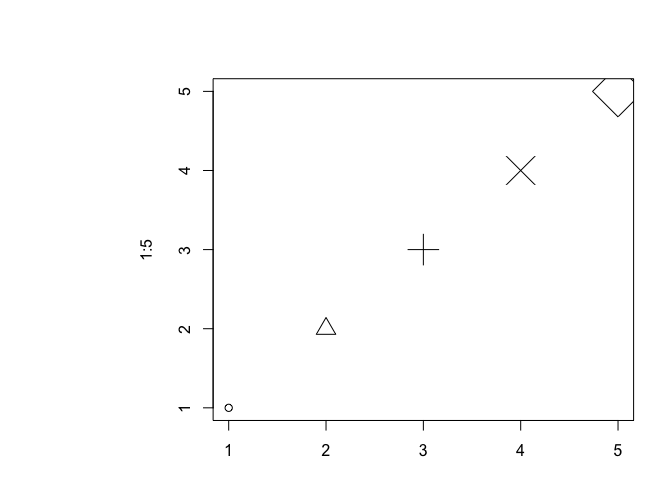
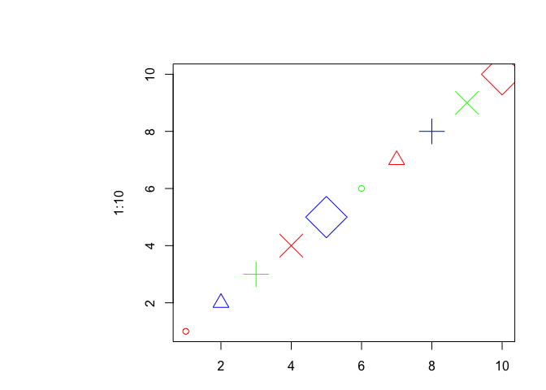
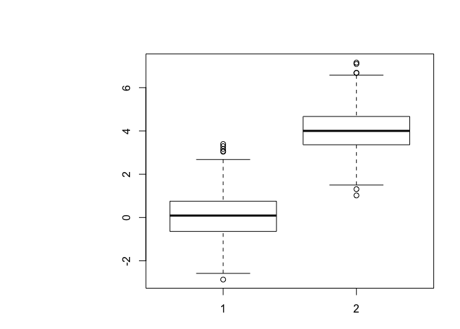
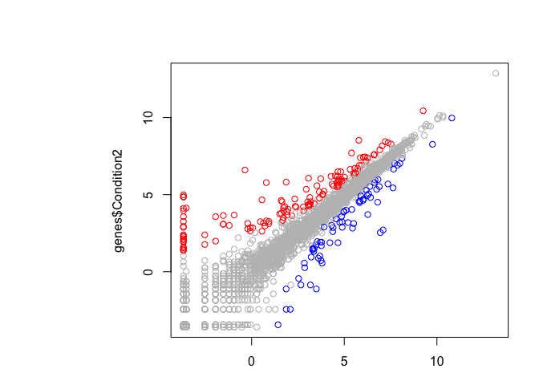
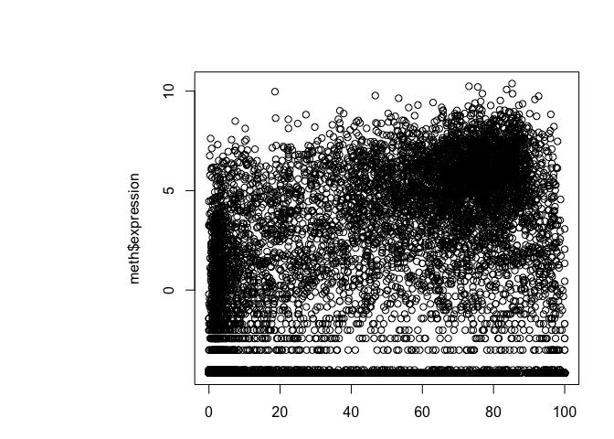
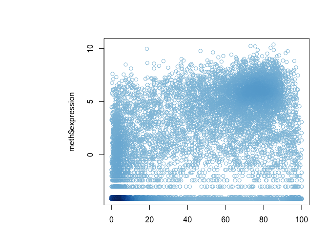
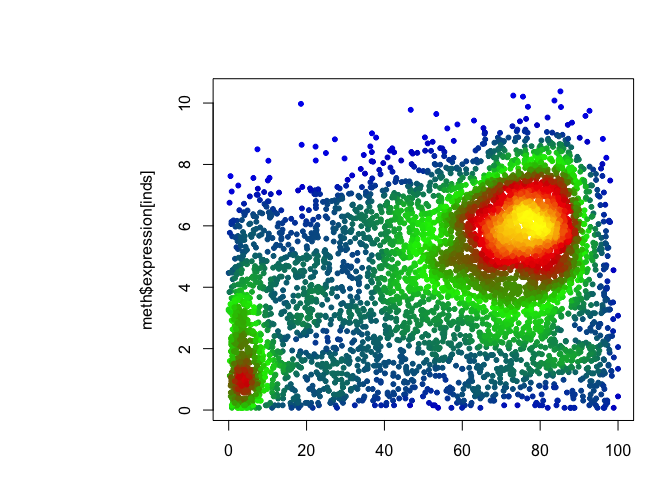

lecture05
================
Nicholas Donahue
11/1/2018

``` r
weight<- read.table("bimm143_05_rstats/weight_chart.txt", header = TRUE)
#
plot(weight$Age, weight$Weight, typ="o", pch=15, cex=1.5, lwd=2, ylim=c(2,10), xlab="Age (months)", ylab="Weight (kg)", main="Baby weight with age") 
```



``` r
#barplot
mouse <- read.table("bimm143_05_rstats/feature_counts.txt", sep="\t", header=TRUE)
par(mar=c(3.1, 11.1, 4.1, 2))
barplot(mouse$Count, names.arg=mouse$Feature, 
        horiz=TRUE, ylab="", 
        main="Number of features in the mouse GRCm38 genome", 
        las=1, xlim=c(0,80000))
```


``` r
#histogram
hist(c(rnorm(100000), rnorm(100000)+4))
```



``` r
#plot characters
plot( 1:5, pch=1:5, cex=1:5 )
```



``` r
#recycling
plot( 1:10, pch=1:5, cex=1:5, col=c("red", "blue", "green") )
```



``` r
#Boxplot
boxplot( cbind( rnorm(1000,0), rnorm(1000,4) ) )
```



``` r
#color in plots
mf<-read.delim("bimm143_05_rstats/male_female_counts.txt", sep="\t", header=TRUE)
barplot(mf$Count, names.arg = mf$Sample, las=2, col=rainbow(nrow(mf)))
```


``` r
barplot(mf$Count, names.arg = mf$Sample, las=2, col=c("red", "blue"))
```


``` r
#3B Coloring by Value
genes<-read.delim("bimm143_05_rstats/up_down_expression.txt")
#how many genes in dataset
nrow(genes)
```

    ## [1] 5196

``` r
#how many are up, down and all around
table(genes$State)
```

    ## 
    ##       down unchanging         up 
    ##         72       4997        127

``` r
#plot of data
palette(c("blue","gray","red"))
plot(genes$Condition1, genes$Condition2, col=genes$State)
```



``` r
#dynamic use of color
meth <- read.delim("bimm143_05_rstats/expression_methylation.txt")
plot(meth$gene.meth, meth$expression)
```



``` r
#
mycols <- densCols(meth$gene.meth, meth$expression)
plot(meth$gene.meth, meth$expression, col=mycols)
```



``` r
#
inds <- meth$expression>0
mycols2 <- densCols(meth$gene.meth[inds], meth$expression[inds], colramp = colorRampPalette(c("blue2", "green2", "red2", "yellow")))
plot(meth$gene.meth[inds], meth$expression[inds], col=mycols2, pch=20)
```



``` r
#Exercise 4 Revisted
```
