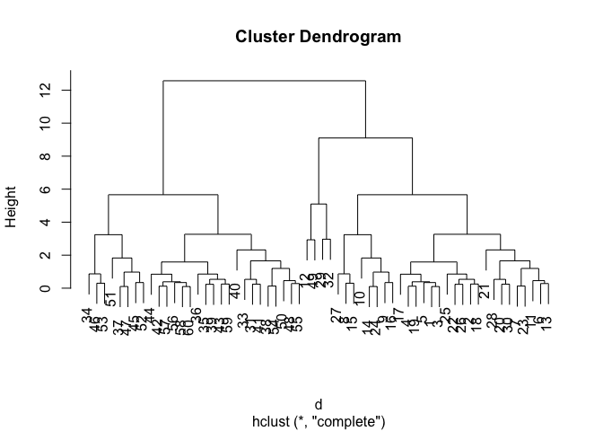
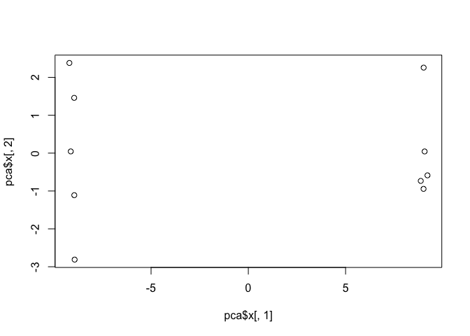

Class 8
================

K-means clustering
------------------

Our first example with **kmeans()** function.

``` r
# Example plot to see how Rmarkdown works
plot(1:10, typ="l")
```


Back to kmeans...

``` r
 # Generate some example data for clustering
tmp <- c(rnorm(30,-3), rnorm(30,3))
x <- cbind(x=tmp, y=rev(tmp))
plot(x)
```


``` r
k<-kmeans(x,centers=2, nstart=20)
k
```

    ## K-means clustering with 2 clusters of sizes 30, 30
    ## 
    ## Cluster means:
    ##           x         y
    ## 1  3.268720 -2.869057
    ## 2 -2.869057  3.268720
    ## 
    ## Clustering vector:
    ##  [1] 2 2 2 2 2 2 2 2 2 2 2 2 2 2 2 2 2 2 2 2 2 2 2 2 2 2 2 2 2 2 1 1 1 1 1
    ## [36] 1 1 1 1 1 1 1 1 1 1 1 1 1 1 1 1 1 1 1 1 1 1 1 1 1
    ## 
    ## Within cluster sum of squares by cluster:
    ## [1] 43.26684 43.26684
    ##  (between_SS / total_SS =  92.9 %)
    ## 
    ## Available components:
    ## 
    ## [1] "cluster"      "centers"      "totss"        "withinss"    
    ## [5] "tot.withinss" "betweenss"    "size"         "iter"        
    ## [9] "ifault"

Use the kmeans() function setting k to 2 and nstart=20 Inspect/print the results Q. How many points are in each cluster?

``` r
k$size
```

    ## [1] 30 30

Q. What ‘component’ of your result object details - cluster size? -k$size - cluster assignment/membership?

``` r
k$cluster
```

    ##  [1] 2 2 2 2 2 2 2 2 2 2 2 2 2 2 2 2 2 2 2 2 2 2 2 2 2 2 2 2 2 2 1 1 1 1 1
    ## [36] 1 1 1 1 1 1 1 1 1 1 1 1 1 1 1 1 1 1 1 1 1 1 1 1 1

``` r
table(k$cluster)
```

    ## 
    ##  1  2 
    ## 30 30

     - cluster center?

``` r
k$centers
```

    ##           x         y
    ## 1  3.268720 -2.869057
    ## 2 -2.869057  3.268720

Plot x colored by the kmeans cluster assignment and add cluster centers as blue points

``` r
palette(c("blue", "red"))
plot(x, col=k$cluster)
points(k$centers, col="green", pch=20, cex=3)
```


Q. Repeat for k=3, which has the lower tot.withinss?

``` r
k3<- kmeans(x, centers=3, nstart = 20)
k3$withinss
```

    ## [1] 43.26684 10.34392 16.37341

``` r
k$withinss
```

    ## [1] 43.26684 43.26684

repeat for k=3 which has lower tot.withinss?

``` r
k2<- kmeans(x, centers=2, nstart = 20)
k3<- kmeans(x, centers=3, nstart = 20)
k4<- kmeans(x, centers=4, nstart = 20)
k5<- kmeans(x, centers=5, nstart = 20)
k2$tot.withinss
```

    ## [1] 86.53369

``` r
k3$tot.withinss
```

    ## [1] 69.98418

``` r
k4$tot.withinss
```

    ## [1] 53.43466

``` r
k5$tot.withinss
```

    ## [1] 43.59486

``` r
plot(c(k2$tot.withinss, k3$tot.withinss, k4$tot.withinss, k5$tot.withinss))
```


Hierarchical Clustering in R
============================

Let's try out the **hclust()** function for hierarchical clustering in R. This function needs a distance matrix as input

``` r
d<-dist(x)
hc<-hclust(d)
plot(hc)
```



``` r
plot(hc)
# Draws a line on the dendogram
abline(h=8, col="red")
```


``` r
# Cut the tree to yield cluster membership vector

cutree(hc, h=8)
```

    ##  [1] 1 1 1 1 1 1 1 1 1 1 1 1 1 1 1 1 1 1 1 1 1 1 1 1 1 1 1 1 1 1 2 2 2 2 2
    ## [36] 2 2 2 2 2 2 2 2 2 2 2 2 2 2 2 2 2 2 2 2 2 2 2 2 2

``` r
cutree(hc, k=2)
```

    ##  [1] 1 1 1 1 1 1 1 1 1 1 1 1 1 1 1 1 1 1 1 1 1 1 1 1 1 1 1 1 1 1 2 2 2 2 2
    ## [36] 2 2 2 2 2 2 2 2 2 2 2 2 2 2 2 2 2 2 2 2 2 2 2 2 2

### A more 'real' example of data clustering

``` r
 # Step 1. Generate some example data for clustering
x <- rbind(
  matrix(rnorm(100, mean=0, sd = 0.3), ncol = 2),   # c1
  matrix(rnorm(100, mean = 1, sd = 0.3), ncol = 2), # c2
  matrix(c(rnorm(50, mean = 1, sd = 0.3),           # c3
           rnorm(50, mean = 0, sd = 0.3)), ncol = 2))
colnames(x) <- c("x", "y")
# Step 2. Plot the data without clustering
plot(x)
```


``` r
# Step 3. Generate colors for known clusters
#         (just so we can compare to hclust results)
col <- as.factor( rep(c("c1","c2","c3"), each=50) )
palette(c("red", "blue", "black"))
plot(x, col=col, pch=20)
```


Q. Use the dist(), hclust(), plot() and cutree() functions to return 2 and 3 clusters

``` r
dist<-dist(x)
clustering2<-hclust(dist)
plot(clustering2)
```


``` r
#cutree function to return 2 and 3 clusters
grp.3<-cutree(clustering2, h=2)
grp.2<-cutree(clustering2, h=2.5)
```

Q. How does this compare to your known 'col' groups?

``` r
table(grp.3, col)
```

    ##      col
    ## grp.3 c1 c2 c3
    ##     1 38  4 11
    ##     2 12  0 28
    ##     3  0 46 11

Principal Component Analysis
============================

Lets make up some data with quite a few dimensions

``` r
 ##Initialize a blank 100 row by 10 column matrix
mydata <- matrix(nrow=100, ncol=10)
##Lets label the rows gene1, gene2 etc. to gene100
rownames(mydata) <- paste("gene", 1:100, sep="")
## Lets label the first 5 columns wt1, wt2, wt3, wt4 and wt5
##  and the last 5 ko1, ko2 etc. to ko5 (for "knock-out")
colnames(mydata) <- c( paste("wt", 1:5, sep=""),
                       paste("ko", 1:5, sep="") )
## Fill in some fake read counts
for(i in 1:nrow(mydata)) {
wt.values <- rpois(5, lambda=sample(x=10:1000, size=1)) 
ko.values <- rpois(5, lambda=sample(x=10:1000, size=1))
  mydata[i,] <- c(wt.values, ko.values)
}
head(mydata)
```

    ##       wt1 wt2 wt3 wt4 wt5 ko1 ko2 ko3 ko4 ko5
    ## gene1 234 250 244 271 230 919 996 991 955 937
    ## gene2 449 478 470 443 410  94  91  91  99 117
    ## gene3 719 775 683 732 702 511 529 517 498 543
    ## gene4  14  14  22  16  24 738 708 765 764 723
    ## gene5 428 451 466 423 378 234 275 255 257 284
    ## gene6 831 785 744 767 829 157 186 142 160 159

Note the precomp()functions want us to take the transpose of our data

``` r
head(t(mydata))
```

    ##     gene1 gene2 gene3 gene4 gene5 gene6 gene7 gene8 gene9 gene10 gene11
    ## wt1   234   449   719    14   428   831   729    14   405    153    242
    ## wt2   250   478   775    14   451   785   730    11   411    136    207
    ## wt3   244   470   683    22   466   744   748    12   422    134    233
    ## wt4   271   443   732    16   423   767   739     9   401    143    214
    ## wt5   230   410   702    24   378   829   762     9   381    131    248
    ## ko1   919    94   511   738   234   157   729   923   459    902    422
    ##     gene12 gene13 gene14 gene15 gene16 gene17 gene18 gene19 gene20 gene21
    ## wt1    331    403    616     19    350    923     78    261    900    618
    ## wt2    328    379    592     16    340    969     89    276    927    591
    ## wt3    303    428    570     14    317    958     94    298    927    574
    ## wt4    374    371    604     13    343    964     96    241    916    639
    ## wt5    347    381    553     15    319    928     76    282    917    541
    ## ko1    423    745    517     64    921    533    921     81    650    726
    ##     gene22 gene23 gene24 gene25 gene26 gene27 gene28 gene29 gene30 gene31
    ## wt1    728    991    789    281    476    887    531    229    469    939
    ## wt2    700    980    778    283    446    924    500    226    470    938
    ## wt3    672    983    801    263    417    880    517    251    454    904
    ## wt4    801    976    748    277    420    877    485    213    437    965
    ## wt5    749   1003    756    302    434    883    526    223    528    921
    ## ko1    313    952    853    261     56    363     92    317    613    271
    ##     gene32 gene33 gene34 gene35 gene36 gene37 gene38 gene39 gene40 gene41
    ## wt1    308    239    923   1053    680    534    527    366    836    478
    ## wt2    328    261    863    966    650    517    537    388    863    546
    ## wt3    297    249    888   1010    663    547    505    397    827    539
    ## wt4    296    260    880    976    621    577    509    365    868    514
    ## wt5    301    229    913   1062    637    535    515    393    865    508
    ## ko1     33    303    632     15    775    918    739    588     79    464
    ##     gene42 gene43 gene44 gene45 gene46 gene47 gene48 gene49 gene50 gene51
    ## wt1    532    250    684    137     16     11     97    688    685     74
    ## wt2    551    245    719    156     25     15     88    709    688     76
    ## wt3    543    271    703    148     22     15    112    709    684     78
    ## wt4    522    224    754    131     27      8     93    705    692     72
    ## wt5    513    267    756    147     31      7    113    707    679     65
    ## ko1    878    595    933    897    949     82    702    403    772    911
    ##     gene52 gene53 gene54 gene55 gene56 gene57 gene58 gene59 gene60 gene61
    ## wt1    905    358    849    930    716    957    662    837    347    270
    ## wt2    918    342    846    961    718   1067    673    802    362    295
    ## wt3    898    357    855    875    727   1000    640    896    334    279
    ## wt4    884    368    798    970    731    986    657    800    346    257
    ## wt5    925    347    867    982    756   1024    661    817    287    269
    ## ko1     88    798     24    207    667    216    201    890    228    142
    ##     gene62 gene63 gene64 gene65 gene66 gene67 gene68 gene69 gene70 gene71
    ## wt1    663    910    163    891    718     75    229    221    935    137
    ## wt2    729    850    143    826    756     64    230    235    972    145
    ## wt3    717    884    195    817    732     75    253    214    983    160
    ## wt4    725    902    169    856    815     74    228    220    993    134
    ## wt5    726    878    157    903    753     74    251    235   1031    134
    ## ko1    681    346   1039    405    338    372    322    320    364    900
    ##     gene72 gene73 gene74 gene75 gene76 gene77 gene78 gene79 gene80 gene81
    ## wt1    619    390    682    437   1064    897    852    851     91    846
    ## wt2    560    388    631    486    973    919    876    822     78    850
    ## wt3    564    397    664    432   1014    883    862    844     67    873
    ## wt4    558    448    607    446    934    940    852    826     73    859
    ## wt5    625    436    622    446    986    909    827    813     88    792
    ## ko1    696     93    898     74    300    354    983    702    398    760
    ##     gene82 gene83 gene84 gene85 gene86 gene87 gene88 gene89 gene90 gene91
    ## wt1     33    512     72    888    966     68    221    742      9    782
    ## wt2     44    579     60    840    922     77    214    758      8    781
    ## wt3     46    548     70    864    965     79    191    714      8    803
    ## wt4     28    523     62    872    901     91    200    737      7    788
    ## wt5     25    502     59    921    919     80    215    722     10    846
    ## ko1     77    717    697    325    829    439     98    534    138    962
    ##     gene92 gene93 gene94 gene95 gene96 gene97 gene98 gene99 gene100
    ## wt1    854    490    821    958    137    699    749    124     921
    ## wt2    911    472    897    905    159    709    699    111     841
    ## wt3    987    526    812    922    168    711    737    119     828
    ## wt4    890    481    815    904    157    733    727    128     806
    ## wt5    940    496    850    929    159    709    759    127     876
    ## ko1    666    781    264     72    659     83    833    161      15

now lets try to find the structure in this data with **prcomp()**

``` r
pca<-prcomp(t(mydata), scale=TRUE)
pca
```

    ## Standard deviations (1, .., p=10):
    ##  [1] 9.490878e+00 1.714017e+00 1.454084e+00 1.230076e+00 1.026882e+00
    ##  [6] 9.443263e-01 8.214596e-01 6.349180e-01 5.777410e-01 3.531197e-15
    ## 
    ## Rotation (n x k) = (100 x 10):
    ##                  PC1           PC2           PC3           PC4
    ## gene1    0.104962703 -0.0047973840  3.959013e-02 -0.0289601295
    ## gene2   -0.104769726  0.0281196440 -3.649742e-03  0.0708707706
    ## gene3   -0.102870823  0.0364849041  3.557682e-03 -0.0026149228
    ## gene4    0.105257071 -0.0154620484 -8.007852e-06 -0.0076031228
    ## gene5   -0.101260203  0.0631433400  8.435875e-02  0.1561174869
    ## gene6   -0.105012418 -0.0018244118  3.113724e-03 -0.0191848463
    ## gene7   -0.003580219 -0.5418967009 -1.523352e-01  0.1201774339
    ## gene8    0.105207822  0.0006824686  2.538508e-02 -0.0171751537
    ## gene9    0.098719476  0.0521808298  5.836910e-02  0.2015758901
    ## gene10   0.105263406  0.0019098524  2.104294e-02 -0.0180522008
    ## gene11   0.104413051 -0.0205741222  2.550707e-02  0.0008273340
    ## gene12   0.093407402 -0.0418475551 -1.371676e-01 -0.2235790051
    ## gene13   0.104482455  0.0280443873  2.744128e-02  0.0228077237
    ## gene14  -0.073227405  0.0367428120  3.087270e-01 -0.0070929117
    ## gene15   0.102615954  0.0542391066  2.774097e-02  0.0418510392
    ## gene16   0.105128687  0.0269716170 -1.412360e-02 -0.0212356454
    ## gene17  -0.104976310  0.0381237976 -2.647066e-02  0.0013936554
    ## gene18   0.105171328 -0.0017087088  2.986860e-02 -0.0183779116
    ## gene19  -0.104001275 -0.0181833358  6.485249e-03  0.0555356086
    ## gene20  -0.104238279 -0.0056637457 -6.196965e-02  0.0309327082
    ## gene21   0.097270675 -0.0160338592  5.571865e-03  0.1220283916
    ## gene22  -0.104202382 -0.0053987689 -4.914321e-02 -0.0439909990
    ## gene23  -0.061117659 -0.3862767802 -1.847890e-01  0.2187273455
    ## gene24   0.091852717  0.0130083286 -6.748661e-02  0.3749505722
    ## gene25  -0.083179143 -0.2050739764 -2.573561e-01 -0.1663852044
    ## gene26  -0.104967588 -0.0072693695  6.022517e-03  0.0210838419
    ## gene27  -0.105249227  0.0135173376 -1.133508e-02  0.0010573950
    ## gene28  -0.105060083 -0.0031029041 -1.233954e-03  0.0186831265
    ## gene29   0.099050255  0.0486990618 -6.108834e-02  0.0670657804
    ## gene30   0.100760361 -0.1007755222  4.137666e-02 -0.1138338950
    ## gene31  -0.105226315  0.0001167496 -8.894556e-03 -0.0146744599
    ## gene32  -0.105182927  0.0143892761 -5.432539e-04 -0.0043245958
    ## gene33   0.063584170  0.3692604643 -2.372969e-01 -0.0862302904
    ## gene34  -0.104078300 -0.0204590948  4.836395e-02 -0.0201491652
    ## gene35  -0.105100007 -0.0139191636 -4.022704e-03  0.0088934151
    ## gene36   0.102442490 -0.0183184507  1.985314e-02  0.1426471753
    ## gene37   0.104955899 -0.0142477385  7.661214e-03  0.0038454842
    ## gene38   0.104055600  0.0359596605  6.694112e-02 -0.0604370742
    ## gene39   0.104351884 -0.0372167495  3.681279e-02 -0.0184202425
    ## gene40  -0.105326746 -0.0081839395 -1.424909e-02 -0.0044930693
    ## gene41  -0.093858265  0.1409593653 -1.753997e-01  0.0277307369
    ## gene42   0.104953754  0.0188732678  3.591536e-02  0.0129284307
    ## gene43   0.104764596 -0.0402149834  4.274811e-02  0.0112395242
    ## gene44   0.101465917 -0.0334139610  3.125304e-02 -0.1678991566
    ## gene45   0.105238804 -0.0005610213  9.880244e-03 -0.0206183146
    ## gene46   0.105244930 -0.0049770578  1.977195e-02 -0.0081355254
    ## gene47   0.104989621  0.0164008722  8.809662e-03  0.0282114408
    ## gene48   0.105124342  0.0064141801 -1.630685e-02 -0.0010382265
    ## gene49  -0.105134740 -0.0259862096 -1.125751e-02  0.0154699952
    ## gene50   0.053825573  0.1040844168 -5.557579e-01  0.1147210783
    ## gene51   0.105271066  0.0069454684 -1.409360e-02 -0.0061055104
    ## gene52  -0.105278300 -0.0016455103 -1.550167e-02  0.0008002528
    ## gene53   0.104959208  0.0207216094  2.162998e-03 -0.0478413274
    ## gene54  -0.105198968 -0.0071270655 -1.001576e-02  0.0174166730
    ## gene55  -0.105144755 -0.0014626485 -1.341453e-03 -0.0416301793
    ## gene56  -0.043518326 -0.4007233036  3.393417e-01 -0.1497909321
    ## gene57  -0.105166210  0.0035411423 -2.152012e-02 -0.0067674623
    ## gene58  -0.105253554 -0.0088973696 -6.450445e-03  0.0101028587
    ## gene59   0.088185614 -0.0396449232  1.225513e-01  0.3230673115
    ## gene60  -0.097741110  0.1189304798  6.586821e-02  0.1467699931
    ## gene61  -0.104295805  0.0329315680 -6.998808e-03  0.0100374484
    ## gene62  -0.076029264 -0.0430983585 -1.965178e-01 -0.1893937503
    ## gene63  -0.105040799  0.0011028671  2.278240e-03 -0.0015539593
    ## gene64   0.105028272  0.0196558882  3.968708e-03 -0.0361979382
    ## gene65  -0.104649560 -0.0357545341 -2.122473e-02 -0.0200505278
    ## gene66  -0.104760100 -0.0049228207 -1.101591e-02 -0.0356638045
    ## gene67   0.104726836  0.0031757275  4.740603e-03  0.0331689242
    ## gene68   0.098602993 -0.0336192937 -8.685415e-02  0.1434783885
    ## gene69   0.102408336 -0.0363836937  2.981980e-02 -0.0036183343
    ## gene70  -0.104991800 -0.0321806064 -2.262717e-02  0.0003500164
    ## gene71   0.105060552 -0.0053519902  8.680504e-03 -0.0188226947
    ## gene72   0.098040823 -0.1293845484  1.167260e-02 -0.0374371828
    ## gene73  -0.104641776 -0.0071785451 -8.822298e-03 -0.0575724299
    ## gene74   0.103767002  0.0089651112  6.625881e-02  0.0325434071
    ## gene75  -0.105183585  0.0130698647 -1.422377e-02 -0.0034177333
    ## gene76  -0.104775114  0.0080306530  7.919020e-03  0.0374609649
    ## gene77  -0.105226723 -0.0086890316 -1.107850e-02 -0.0030629264
    ## gene78   0.091555250  0.0416251169 -1.424425e-01  0.1394852537
    ## gene79  -0.101497304  0.0345649782  1.260919e-01  0.0173033757
    ## gene80   0.105093707 -0.0095818408 -1.663661e-02 -0.0205412585
    ## gene81  -0.082640936  0.0383043364  1.704433e-02  0.4225749660
    ## gene82   0.100954561  0.0115476304  1.115996e-01  0.0706916577
    ## gene83   0.101630416  0.0914862514  2.455863e-02 -0.0214648252
    ## gene84   0.105163382 -0.0129778504  2.483750e-02 -0.0108790513
    ## gene85  -0.104853187 -0.0337945194 -3.453774e-02  0.0064895925
    ## gene86  -0.089268766  0.1466393384  1.731007e-01  0.1136517244
    ## gene87   0.104962459  0.0074821958 -1.924435e-02 -0.0497649663
    ## gene88  -0.103716190 -0.0108250406 -4.567287e-02  0.0299316875
    ## gene89  -0.103384342  0.0956875799 -2.848038e-03 -0.0375305422
    ## gene90   0.104680055  0.0043683576  2.419883e-02  0.0244535898
    ## gene91   0.094380868 -0.1800460019 -1.487317e-01 -0.0137825760
    ## gene92  -0.101675346 -0.0050210900 -3.311001e-02  0.0659415839
    ## gene93   0.103761520  0.0200304561  1.421792e-02  0.0514546952
    ## gene94  -0.105028680  0.0025669775 -2.170219e-02  0.0105930137
    ## gene95  -0.105220064 -0.0043085648 -5.523705e-03  0.0150944555
    ## gene96   0.105182244 -0.0090836372  1.676385e-02 -0.0064270001
    ## gene97  -0.105302728 -0.0015421278 -1.185816e-02  0.0015177052
    ## gene98   0.094606171 -0.1628191514 -1.019137e-01  0.1519237423
    ## gene99   0.089319958  0.0282860282 -1.023262e-01 -0.2330105717
    ## gene100 -0.105042465 -0.0039601551 -5.490581e-04  0.0124522481
    ##                   PC5           PC6           PC7           PC8
    ## gene1   -1.002772e-02 -0.0553338677 -0.0029088955 -0.0163883214
    ## gene2    1.024440e-02 -0.0293610092 -0.0093294999 -0.0191524962
    ## gene3   -7.879766e-02 -0.1089754379 -0.0298968041  0.1270170056
    ## gene4    4.642072e-03 -0.0161572822 -0.0317771157 -0.0257765276
    ## gene5    3.634163e-02 -0.1082439532  0.0251239135 -0.0317181180
    ## gene6   -2.011032e-02  0.0761279430  0.0034499388  0.0200759627
    ## gene7    5.020061e-02 -0.1942707208  0.0559450284 -0.2247250828
    ## gene8   -1.039624e-02 -0.0216831489  0.0217961329  0.0114975568
    ## gene9    9.909473e-02 -0.0883095666 -0.1948595483 -0.0761523667
    ## gene10  -1.191354e-02 -0.0128224454 -0.0105583261 -0.0091039267
    ## gene11   4.554489e-02  0.1076575676 -0.0530233052  0.0397401605
    ## gene12  -2.084811e-01 -0.1152124286 -0.1184524986  0.1768994668
    ## gene13  -5.611233e-03  0.0126374785  0.1320766633  0.0081676325
    ## gene14  -4.861527e-01 -0.2240113614 -0.0451560411 -0.1994964058
    ## gene15  -1.554376e-02  0.0564360439  0.0483019168  0.2763531393
    ## gene16  -1.917349e-02  0.0060585600 -0.0327551365 -0.0023284137
    ## gene17   2.877080e-02 -0.0195738989  0.0051329207 -0.0134488341
    ## gene18  -2.755699e-03 -0.0358069984  0.0058612858 -0.0049457406
    ## gene19   8.946829e-02  0.0333499279  0.1106608721 -0.0461627728
    ## gene20   6.348175e-02  0.0068229417 -0.0880303572 -0.0663148470
    ## gene21  -2.420552e-01 -0.1826524627 -0.1830851693  0.1150517455
    ## gene22  -6.308238e-02  0.0032657085 -0.0279758699  0.1035229381
    ## gene23  -2.318873e-01 -0.0533691725  0.1118340308 -0.0513235625
    ## gene24   4.404796e-03  0.0742138833  0.0598908803  0.0600003086
    ## gene25  -9.621508e-02  0.1513554658 -0.1181529713 -0.0326549832
    ## gene26  -4.578394e-02  0.0525962735 -0.0287893731 -0.0357556625
    ## gene27  -8.708384e-04  0.0022191342  0.0153785818 -0.0301989380
    ## gene28   1.184460e-03  0.0677267681  0.0400731556 -0.0088302784
    ## gene29   1.702637e-01  0.1194662947 -0.0892123872 -0.3309977003
    ## gene30   5.573532e-02  0.1024806605  0.0639290317  0.0029953714
    ## gene31  -3.002379e-02 -0.0081612839 -0.0144466921 -0.0392135860
    ## gene32  -1.285955e-03  0.0056231555 -0.0036745596 -0.0486611426
    ## gene33  -9.105181e-02 -0.2375977780  0.2604350670 -0.0045033261
    ## gene34  -3.973512e-02  0.1116114314  0.0735606525 -0.0166188110
    ## gene35  -1.692382e-03  0.0648941488  0.0208175231 -0.0061781688
    ## gene36  -6.010420e-02  0.0894201720 -0.0067489645 -0.1164682580
    ## gene37  -1.881769e-02 -0.0501995327 -0.0127192348  0.0664576055
    ## gene38   1.157352e-02  0.0073153148 -0.0415514124 -0.0233159049
    ## gene39   4.161911e-02 -0.0517656353  0.0695069574 -0.0723792122
    ## gene40  -2.475339e-03 -0.0029323557 -0.0049827207  0.0041298833
    ## gene41   2.396743e-01 -0.1212182580  0.0875575826 -0.0300830207
    ## gene42   2.878892e-02 -0.0245711119 -0.0431758310  0.0029983096
    ## gene43   1.655664e-02 -0.0139562668  0.0399780262 -0.0138280721
    ## gene44   8.687616e-02 -0.0619336686 -0.1179032387 -0.0723472759
    ## gene45  -2.294864e-03 -0.0218638658  0.0199945827 -0.0221893619
    ## gene46   7.491348e-03 -0.0189969629 -0.0170888903  0.0359367893
    ## gene47  -4.470025e-03 -0.0408895009  0.0459654652 -0.0108778790
    ## gene48  -7.884177e-03  0.0016245909  0.0614204403  0.0540714265
    ## gene49   2.172911e-02 -0.0280239477 -0.0027260093 -0.0346284813
    ## gene50  -1.040392e-01  0.0809823704 -0.1185230732 -0.0903748497
    ## gene51   7.495217e-03 -0.0026215719 -0.0369216166 -0.0186465855
    ## gene52   7.422170e-03  0.0266602191  0.0122202035 -0.0263536865
    ## gene53  -6.048123e-03 -0.0016218139 -0.0075015490 -0.0739573080
    ## gene54   1.626190e-02  0.0395474535  0.0228950467 -0.0227747352
    ## gene55  -5.921575e-03  0.0095235420 -0.0153340047  0.0538465549
    ## gene56   1.047759e-01 -0.1960741603  0.1583249061  0.2058564049
    ## gene57   3.393667e-02 -0.0116505613  0.0116818904 -0.0217007806
    ## gene58  -5.235718e-05  0.0114001385 -0.0448978796  0.0001633334
    ## gene59   1.972778e-01  0.0993361554  0.1839912086 -0.1549812866
    ## gene60  -1.411024e-01 -0.1756230637 -0.0408544309  0.0731267427
    ## gene61   3.973575e-02 -0.0021204984  0.0498802753 -0.1161338749
    ## gene62   4.018889e-01 -0.4295352208  0.0454918817  0.0600237390
    ## gene63  -3.828661e-02  0.0284553090  0.0355272129 -0.0342640444
    ## gene64   1.835009e-02  0.0061369904 -0.0045581611 -0.0766958343
    ## gene65  -4.798639e-02  0.0785298984  0.0014776634  0.0140831612
    ## gene66  -1.478971e-02 -0.0777480903 -0.0051690491  0.0518988363
    ## gene67  -6.808327e-03 -0.0014454133  0.0192483518  0.1574118368
    ## gene68   1.372452e-01  0.0731825578  0.0894864892  0.3293670987
    ## gene69   8.408895e-02  0.0068445807 -0.2094578076  0.1214490666
    ## gene70   3.414374e-02 -0.0068350239  0.0220092529  0.0501483885
    ## gene71  -1.978170e-02 -0.0366490743  0.0512213973 -0.0582241210
    ## gene72  -3.824400e-02  0.2727155767 -0.1345880717 -0.0384664270
    ## gene73   2.249638e-02  0.0058099184 -0.0116412661  0.0619978362
    ## gene74   1.174798e-02  0.0780005059 -0.0663741000 -0.1604350716
    ## gene75   3.592201e-03 -0.0198581763 -0.0009830904  0.0079475081
    ## gene76  -1.018436e-02  0.0893494958  0.0170746573 -0.0563652189
    ## gene77  -5.557347e-03 -0.0182642497 -0.0458183199  0.0188868216
    ## gene78  -2.052149e-01 -0.2108818216  0.3156220202  0.0051980814
    ## gene79  -7.077301e-02  0.0322188856  0.1213547870 -0.1967588594
    ## gene80  -4.507463e-02  0.0085800931  0.0255878744 -0.0047413127
    ## gene81  -2.628654e-02 -0.2565158660 -0.2073059041  0.1110140365
    ## gene82   4.958562e-02 -0.1401946300  0.0625831385 -0.2039410195
    ## gene83   1.015834e-01 -0.1046617214 -0.0604708790 -0.1668262227
    ## gene84  -2.051373e-02 -0.0295529794  0.0171814797 -0.0257126964
    ## gene85  -1.566851e-02  0.0526939924  0.0212319746  0.0089042318
    ## gene86  -8.340357e-04  0.2163320736  0.3617440504  0.1209127653
    ## gene87  -7.803931e-03 -0.0306091788  0.0168421217 -0.0654172301
    ## gene88  -7.877928e-02  0.0793960298  0.0036377100  0.1218115753
    ## gene89   1.580540e-02  0.0559514237 -0.0682455862  0.0456177392
    ## gene90   1.032946e-02 -0.0004537635 -0.0029334758  0.1580106926
    ## gene91  -6.838084e-02 -0.0384201671  0.2651655261 -0.0477248332
    ## gene92   2.030809e-01 -0.0084250273  0.1457128930  0.0389145275
    ## gene93   2.268077e-02  0.0180204138  0.1400021009  0.1597897339
    ## gene94   2.586246e-02  0.0032745380 -0.0327641898  0.0252263168
    ## gene95  -1.145009e-02  0.0426010446  0.0088716542 -0.0280656514
    ## gene96   3.121543e-02 -0.0301665381 -0.0313533631  0.0056011639
    ## gene97  -3.248866e-03 -0.0080357088  0.0118678573 -0.0116688666
    ## gene98  -5.278924e-02  0.1678876758 -0.0251808879  0.2387462130
    ## gene99  -1.998477e-01  0.0990909077  0.3506225587 -0.0957512212
    ## gene100 -2.121007e-02  0.0756433086  0.0035587691 -0.0164221807
    ##                   PC9          PC10
    ## gene1    0.0049237385 -0.1015602783
    ## gene2    0.0255531737 -0.0172564836
    ## gene3    0.2359271263  0.0955565871
    ## gene4    0.0110020769  0.0187360202
    ## gene5    0.0150605387 -0.0535329429
    ## gene6    0.0307964583 -0.0073577508
    ## gene7   -0.1388659253  0.3598670892
    ## gene8    0.0274419557  0.0227490076
    ## gene9   -0.0245288779 -0.1923224980
    ## gene10   0.0144714474 -0.0074589640
    ## gene11  -0.0299074335 -0.0283070403
    ## gene12  -0.2031166923 -0.0233794934
    ## gene13   0.0042059317  0.0130445027
    ## gene14   0.0090690964  0.2203631731
    ## gene15   0.0965638095  0.0668583450
    ## gene16   0.0154964618 -0.0055078721
    ## gene17  -0.0295869344  0.0147823057
    ## gene18   0.0144741989 -0.0128097774
    ## gene19   0.0653144053  0.0008993116
    ## gene20  -0.0302579037 -0.0624188133
    ## gene21  -0.1210362392 -0.0380288054
    ## gene22  -0.1194195058 -0.0093625914
    ## gene23   0.1883654388 -0.4184532509
    ## gene24   0.1584228509  0.2801608004
    ## gene25   0.3060262299 -0.0270593654
    ## gene26   0.0507665270 -0.0270432198
    ## gene27   0.0502005036 -0.0637379013
    ## gene28   0.0009374963 -0.0342816792
    ## gene29  -0.0727166535 -0.2246211682
    ## gene30   0.2257917090 -0.0281145720
    ## gene31  -0.0325818960 -0.0633967683
    ## gene32   0.0736314554 -0.0373786248
    ## gene33  -0.0141947618 -0.3044059532
    ## gene34  -0.0529613316 -0.0478444780
    ## gene35  -0.0257775450 -0.0253209688
    ## gene36   0.1300595134 -0.0904330236
    ## gene37  -0.0862793367 -0.0007775307
    ## gene38   0.1136893047  0.0093952206
    ## gene39   0.0791251527 -0.0350210601
    ## gene40  -0.0075456544 -0.0157681499
    ## gene41   0.0895932579  0.0997056331
    ## gene42   0.0568232293  0.0900747331
    ## gene43   0.0527055692  0.0255700128
    ## gene44  -0.0726295515  0.0938914068
    ## gene45   0.0434694707  0.0276368991
    ## gene46   0.0223717608  0.0086795453
    ## gene47   0.0765514560  0.0156224430
    ## gene48   0.0148276513  0.0001208235
    ## gene49  -0.0125747269  0.0873720635
    ## gene50  -0.1121623174  0.0866070862
    ## gene51   0.0088405270 -0.0365648867
    ## gene52   0.0113173931  0.0082282165
    ## gene53  -0.0443620231 -0.0292847477
    ## gene54   0.0154617832 -0.0068534146
    ## gene55   0.0160440688  0.0511030327
    ## gene56  -0.0332341411 -0.2586770910
    ## gene57   0.0562057596 -0.0126800660
    ## gene58   0.0212368035 -0.0080269723
    ## gene59  -0.2615726770 -0.0151299537
    ## gene60   0.1143461575  0.0133730259
    ## gene61   0.1543573922 -0.0702060916
    ## gene62   0.0266269440 -0.0591822490
    ## gene63  -0.0869041502  0.0050896611
    ## gene64  -0.0364720702 -0.0205680251
    ## gene65  -0.0242430738  0.0063610025
    ## gene66  -0.0858373682 -0.0444064774
    ## gene67   0.0099353731  0.0438033770
    ## gene68  -0.0096971483  0.0457167829
    ## gene69   0.1393860911 -0.0494869955
    ## gene70  -0.0310631913  0.0596998701
    ## gene71   0.0263101214 -0.0469133598
    ## gene72   0.0755956064  0.0359094653
    ## gene73  -0.1355454992  0.0325036567
    ## gene74   0.0121502522 -0.1250420986
    ## gene75   0.0791170755  0.0036901693
    ## gene76  -0.0022935344 -0.0381798139
    ## gene77  -0.0259316026 -0.0250796642
    ## gene78   0.2204231526  0.0873101647
    ## gene79  -0.0903521280 -0.0159964862
    ## gene80   0.0541313856 -0.0173856874
    ## gene81  -0.2211765061 -0.1484551384
    ## gene82   0.1561442669  0.0245164272
    ## gene83   0.1616539536 -0.0756550011
    ## gene84   0.0207886865  0.0118312372
    ## gene85  -0.0446934195  0.0268580400
    ## gene86   0.0234709786 -0.0792793455
    ## gene87  -0.0175453869 -0.0157982391
    ## gene88   0.1424525541 -0.0092967909
    ## gene89   0.0585963170 -0.1091957349
    ## gene90   0.0411165221  0.0455156260
    ## gene91   0.0461968645 -0.0720875706
    ## gene92  -0.0632690130  0.1885095944
    ## gene93  -0.0262183380  0.1264287760
    ## gene94   0.1021128080  0.0232941713
    ## gene95  -0.0208817131 -0.0065183887
    ## gene96   0.0108500349 -0.0077505204
    ## gene97  -0.0438778108 -0.0027499236
    ## gene98  -0.1502731264 -0.2284952151
    ## gene99  -0.3338302162  0.0055878099
    ## gene100  0.0193367111 -0.0140338235

Make a PC plot of PC2 vs PC2. For this use the '*x*′*c**o**m**p**o**n**e**n**t**o**f**o**u**t**p**u**t*(*i*.*e**p**c**a*x)

``` r
plot(pca$x[,1], pca$x[,2])
```

 Lets see how well PCS are doing (how much variance form the original data are they capturing)

``` r
#variance captured per PC
pca.var<-pca$sdev^2
pca.var
```

    ##  [1] 9.007676e+01 2.937854e+00 2.114361e+00 1.513086e+00 1.054488e+00
    ##  [6] 8.917522e-01 6.747958e-01 4.031209e-01 3.337847e-01 1.246935e-29

``` r
pca.var.per<-round(pca.var/sum(pca.var)*100,1)
pca.var.per
```

    ##  [1] 90.1  2.9  2.1  1.5  1.1  0.9  0.7  0.4  0.3  0.0

Make a "scree-plot" to see the variance captured in each PC

``` r
barplot(pca.var.per, main="Scree Plot",
        xlab="Principal Component", ylab="Percent Variation")
```


Lets make our plot a bit more useful...

``` r
## A vector of colors for wt and ko samples
colvec <- colnames(mydata)
colvec[grep("wt", colvec)] <- "red"
colvec[grep("ko", colvec)] <- "blue"
plot(pca$x[,1], pca$x[,2], col=colvec, pch=16,
     xlab=paste0("PC1 (", pca.var.per[1], "%)"),
     ylab=paste0("PC2 (", pca.var.per[2], "%)"))
```


Hands on section Food plot failure
==================================

Including Plots
---------------

You can also embed plots, for example:


Note that the `echo = FALSE` parameter was added to the code chunk to prevent printing of the R code that generated the plot.
