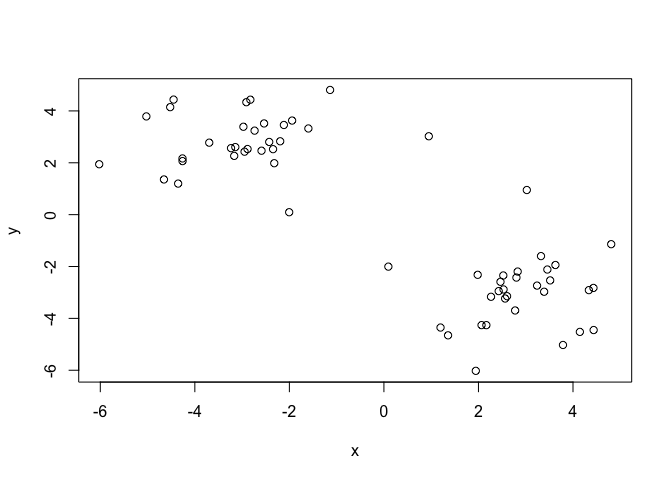
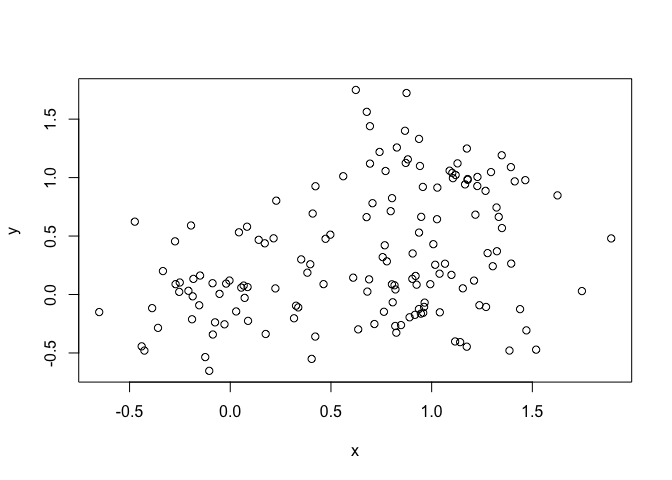
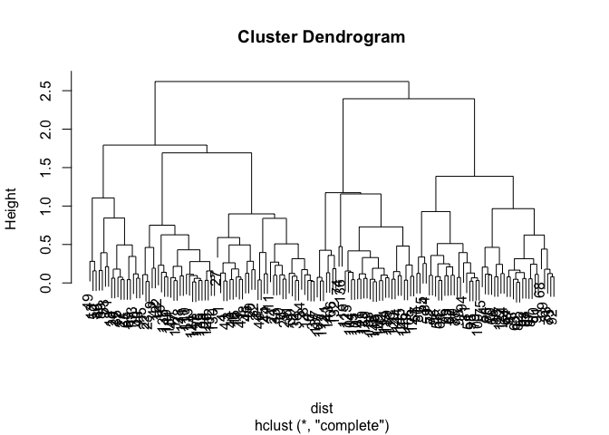

Class 8
================

K-means clustering
------------------

Our first example with **kmeans()** function.

``` r
# Example plot to see how Rmarkdown works
plot(1:10, typ="l")
```


Back to kmeans...

``` r
 # Generate some example data for clustering
tmp <- c(rnorm(30,-3), rnorm(30,3))
x <- cbind(x=tmp, y=rev(tmp))
plot(x)
```



``` r
k<-kmeans(x,centers=2, nstart=20)
k
```

    ## K-means clustering with 2 clusters of sizes 30, 30
    ## 
    ## Cluster means:
    ##           x         y
    ## 1  2.870875 -3.010850
    ## 2 -3.010850  2.870875
    ## 
    ## Clustering vector:
    ##  [1] 2 2 2 2 2 2 2 2 2 2 2 2 2 2 2 2 2 2 2 2 2 2 2 2 2 2 2 2 2 2 1 1 1 1 1
    ## [36] 1 1 1 1 1 1 1 1 1 1 1 1 1 1 1 1 1 1 1 1 1 1 1 1 1
    ## 
    ## Within cluster sum of squares by cluster:
    ## [1] 84.24449 84.24449
    ##  (between_SS / total_SS =  86.0 %)
    ## 
    ## Available components:
    ## 
    ## [1] "cluster"      "centers"      "totss"        "withinss"    
    ## [5] "tot.withinss" "betweenss"    "size"         "iter"        
    ## [9] "ifault"

Use the kmeans() function setting k to 2 and nstart=20 Inspect/print the results Q. How many points are in each cluster?

``` r
k$size
```

    ## [1] 30 30

Q. What ‘component’ of your result object details - cluster size? -k$size - cluster assignment/membership?

``` r
k$cluster
```

    ##  [1] 2 2 2 2 2 2 2 2 2 2 2 2 2 2 2 2 2 2 2 2 2 2 2 2 2 2 2 2 2 2 1 1 1 1 1
    ## [36] 1 1 1 1 1 1 1 1 1 1 1 1 1 1 1 1 1 1 1 1 1 1 1 1 1

``` r
table(k$cluster)
```

    ## 
    ##  1  2 
    ## 30 30

     - cluster center?

``` r
k$centers
```

    ##           x         y
    ## 1  2.870875 -3.010850
    ## 2 -3.010850  2.870875

Plot x colored by the kmeans cluster assignment and add cluster centers as blue points

``` r
palette(c("blue", "red"))
plot(x, col=k$cluster)
points(k$centers, col="green", pch=20, cex=3)
```


Q. Repeat for k=3, which has the lower tot.withinss?

``` r
k3<- kmeans(x, centers=3, nstart = 20)
k3$withinss
```

    ## [1] 84.24449 14.94025 36.93632

``` r
k$withinss
```

    ## [1] 84.24449 84.24449

repeat for k=3 which has lower tot.withinss?

``` r
k2<- kmeans(x, centers=2, nstart = 20)
k3<- kmeans(x, centers=3, nstart = 20)
k4<- kmeans(x, centers=4, nstart = 20)
k5<- kmeans(x, centers=5, nstart = 20)
k2$tot.withinss
```

    ## [1] 168.489

``` r
k3$tot.withinss
```

    ## [1] 136.1211

``` r
k4$tot.withinss
```

    ## [1] 103.7532

``` r
k5$tot.withinss
```

    ## [1] 85.35587

``` r
plot(c(k2$tot.withinss, k3$tot.withinss, k4$tot.withinss, k5$tot.withinss))
```


Hierarchical Clustering in R
============================

Let's try out the **hclust()** function for hierarchical clustering in R. This function needs a distance matrix as input

``` r
d<-dist(x)
hc<-hclust(d)
plot(hc)
```


``` r
plot(hc)
# Draws a line on the dendogram
abline(h=8, col="red")
```


``` r
# Cut the tree to yield cluster membership vector

cutree(hc, h=8)
```

    ##  [1] 1 1 1 1 1 1 1 1 1 1 1 2 1 1 1 1 1 1 1 1 1 1 1 1 1 1 1 1 2 1 3 2 3 3 3
    ## [36] 3 3 3 3 3 3 3 3 3 3 3 3 3 2 3 3 3 3 3 3 3 3 3 3 3

``` r
cutree(hc, k=2)
```

    ##  [1] 1 1 1 1 1 1 1 1 1 1 1 1 1 1 1 1 1 1 1 1 1 1 1 1 1 1 1 1 1 1 2 1 2 2 2
    ## [36] 2 2 2 2 2 2 2 2 2 2 2 2 2 1 2 2 2 2 2 2 2 2 2 2 2

### A more 'real' example of data clustering

``` r
 # Step 1. Generate some example data for clustering
x <- rbind(
  matrix(rnorm(100, mean=0, sd = 0.3), ncol = 2),   # c1
  matrix(rnorm(100, mean = 1, sd = 0.3), ncol = 2), # c2
  matrix(c(rnorm(50, mean = 1, sd = 0.3),           # c3
           rnorm(50, mean = 0, sd = 0.3)), ncol = 2))
colnames(x) <- c("x", "y")
# Step 2. Plot the data without clustering
plot(x)
```



``` r
# Step 3. Generate colors for known clusters
#         (just so we can compare to hclust results)
col <- as.factor( rep(c("c1","c2","c3"), each=50) )
palette(c("red", "blue", "black"))
plot(x, col=col, pch=20)
```


Q. Use the dist(), hclust(), plot() and cutree() functions to return 2 and 3 clusters

``` r
dist<-dist(x)
clustering2<-hclust(dist)
plot(clustering2)
```



``` r
#cutree function to return 2 and 3 clusters
grp.3<-cutree(clustering2, h=2)
grp.2<-cutree(clustering2, h=2.5)
```

Q. How does this compare to your known 'col' groups?

``` r
table(grp.3, col)
```

    ##      col
    ## grp.3 c1 c2 c3
    ##     1 50  6 17
    ##     2  0 43  2
    ##     3  0  1 31

Principal Component Analysis
============================

Lets make up some data with quite a few dimensions

``` r
 ##Initialize a blank 100 row by 10 column matrix
mydata <- matrix(nrow=100, ncol=10)
##Lets label the rows gene1, gene2 etc. to gene100
rownames(mydata) <- paste("gene", 1:100, sep="")
## Lets label the first 5 columns wt1, wt2, wt3, wt4 and wt5
##  and the last 5 ko1, ko2 etc. to ko5 (for "knock-out")
colnames(mydata) <- c( paste("wt", 1:5, sep=""),
                       paste("ko", 1:5, sep="") )
## Fill in some fake read counts
for(i in 1:nrow(mydata)) {
wt.values <- rpois(5, lambda=sample(x=10:1000, size=1)) 
ko.values <- rpois(5, lambda=sample(x=10:1000, size=1))
  mydata[i,] <- c(wt.values, ko.values)
}
head(mydata)
```

    ##       wt1 wt2 wt3 wt4 wt5 ko1 ko2 ko3 ko4 ko5
    ## gene1 904 875 926 868 881 103 102 100 110  98
    ## gene2 605 570 598 535 582 832 775 827 758 791
    ## gene3 213 228 237 238 216 870 918 871 868 845
    ## gene4 279 233 248 253 255 188 185 192 196 156
    ## gene5 861 866 927 945 819 672 766 710 736 732
    ## gene6 946 948 947 948 949 967 906 969 975 966

Note the precomp()functions want us to take the transpose of our data

``` r
head(t(mydata))
```

    ##     gene1 gene2 gene3 gene4 gene5 gene6 gene7 gene8 gene9 gene10 gene11
    ## wt1   904   605   213   279   861   946   386   751   944    781    757
    ## wt2   875   570   228   233   866   948   451   787   934    760    778
    ## wt3   926   598   237   248   927   947   427   807   947    802    760
    ## wt4   868   535   238   253   945   948   490   765   924    757    777
    ## wt5   881   582   216   255   819   949   408   804   997    821    768
    ## ko1   103   832   870   188   672   967   443   273   272    461    495
    ##     gene12 gene13 gene14 gene15 gene16 gene17 gene18 gene19 gene20 gene21
    ## wt1    177    232    643    133    832    543    433    501    819    100
    ## wt2    145    248    677    164    816    578    382    498    870     92
    ## wt3    164    232    643    145    834    510    444    520    827     92
    ## wt4    143    247    662    138    807    553    452    544    739     92
    ## wt5    160    249    665    157    886    530    399    498    867     82
    ## ko1    688    847    873    957    798    167     25    399    517    112
    ##     gene22 gene23 gene24 gene25 gene26 gene27 gene28 gene29 gene30 gene31
    ## wt1    772    873    992    490     28    287    616    181    166     17
    ## wt2    821    858    918    510     30    291    626    188    191     11
    ## wt3    809    904    965    473     25    295    620    164    186     11
    ## wt4    762    854    931    490     26    325    593    167    175     12
    ## wt5    773    869    991    501     30    316    625    181    196     15
    ## ko1    431    682    764    780     93    565     45     10    298    147
    ##     gene32 gene33 gene34 gene35 gene36 gene37 gene38 gene39 gene40 gene41
    ## wt1    759    162    649    135    869    768    693    722    711    568
    ## wt2    757    143    644    151    844    736    718    719    634    536
    ## wt3    685    160    588    155    839    832    655    736    652    612
    ## wt4    706    150    630    117    840    813    732    751    674    529
    ## wt5    751    170    660    144    865    805    627    728    696    549
    ## ko1    891    681    380     34    906    105    722    322    567    404
    ##     gene42 gene43 gene44 gene45 gene46 gene47 gene48 gene49 gene50 gene51
    ## wt1    259    510     58    574    360    874   1037    107    287     48
    ## wt2    248    502     44    544    336    842    951    103    317     50
    ## wt3    284    495     40    553    339    856    952    100    295     55
    ## wt4    281    497     49    530    328    876    939     94    286     52
    ## wt5    280    491     51    537    342    874    959    124    293     47
    ## ko1    756    385    359    834    264    211    132      6    456    598
    ##     gene52 gene53 gene54 gene55 gene56 gene57 gene58 gene59 gene60 gene61
    ## wt1    972    242    475    589     82    897    534    815    481    282
    ## wt2    911    214    477    554     64    959    555    781    431    278
    ## wt3    896    246    454    594     75    910    512    822    502    296
    ## wt4    916    239    492    567     73    896    554    738    446    280
    ## wt5    920    251    462    623     62    942    511    796    498    282
    ## ko1    154    637    212    458    301    885    298    633    891    777
    ##     gene62 gene63 gene64 gene65 gene66 gene67 gene68 gene69 gene70 gene71
    ## wt1     43    433    689    990    503    417    895    397    210    922
    ## wt2     40    468    647    888    553    396    880    393    196    953
    ## wt3     49    499    626    872    545    401    875    405    225    834
    ## wt4     44    461    646    925    556    394    918    391    216    894
    ## wt5     40    485    702    916    552    404    862    420    195    954
    ## ko1    867    193    827    901    893    508    715    886    691    505
    ##     gene72 gene73 gene74 gene75 gene76 gene77 gene78 gene79 gene80 gene81
    ## wt1    549    185    528    853     10    378    915    952    531    872
    ## wt2    488    151    514    832     20    365    949    866    550    886
    ## wt3    506    175    499    872     18    354    935    865    516    884
    ## wt4    553    181    501    839     13    318    942    914    602    899
    ## wt5    488    172    522    836     13    357    935    877    536    927
    ## ko1    807    689    670    129    522    549    172    246    487    513
    ##     gene82 gene83 gene84 gene85 gene86 gene87 gene88 gene89 gene90 gene91
    ## wt1    637    615    738    922    595    146    671    772    951    341
    ## wt2    600    557    771    981    662    155    684    755    990    350
    ## wt3    631    578    730    839    572    151    703    696    982    316
    ## wt4    568    562    755    899    638    137    675    725   1011    338
    ## wt5    598    558    776    937    627    135    673    709   1015    337
    ## ko1    963    794    144    798    860     49    617    418    704    290
    ##     gene92 gene93 gene94 gene95 gene96 gene97 gene98 gene99 gene100
    ## wt1    429    678    988    949    194    493    893    540     476
    ## wt2    388    665    966    937    185    459    904    518     459
    ## wt3    381    676   1011    991    201    479    909    547     455
    ## wt4    356    682    989   1000    198    468    935    514     464
    ## wt5    404    606   1003    975    194    446    919    550     427
    ## ko1    691    397    826    192    852    122    514    351     628

now lets try to find the structure in this data with **prcomp()**

``` r
pca<-prcomp(t(mydata), scale=TRUE)
pca
```

    ## Standard deviations (1, .., p=10):
    ##  [1] 9.520651e+00 1.626217e+00 1.280524e+00 1.217882e+00 1.086141e+00
    ##  [6] 9.109744e-01 8.094602e-01 7.727389e-01 5.724632e-01 3.420503e-15
    ## 
    ## Rotation (n x k) = (100 x 10):
    ##                 PC1           PC2           PC3           PC4          PC5
    ## gene1   -0.10495365  4.409519e-03 -3.016592e-03 -0.0041909422  0.025277910
    ## gene2    0.10188144  1.080097e-01  1.298199e-02  0.0066205411  0.004324800
    ## gene3    0.10487160 -9.562831e-03 -2.290439e-03 -0.0370035109 -0.008280870
    ## gene4   -0.09682093  9.748299e-02  1.905382e-01 -0.0691201227  0.161689155
    ## gene5   -0.09416485 -1.919099e-01 -1.238625e-02 -0.1218938090  0.146055804
    ## gene6    0.02559476  1.248602e-01  1.650883e-02  0.7383564773  0.256149695
    ## gene7    0.05207648 -4.305442e-01  5.378723e-04  0.0842827405 -0.004204828
    ## gene8   -0.10478479 -2.446243e-03 -3.516225e-02 -0.0158758368 -0.018608630
    ## gene9   -0.10492030  1.857932e-02 -1.285359e-02 -0.0120246458 -0.009452499
    ## gene10  -0.10447198  4.325451e-02 -4.343851e-02 -0.0347480663  0.009377531
    ## gene11  -0.10407429 -4.445966e-03  2.631018e-02  0.0897622734  0.017973304
    ## gene12   0.10476683  1.201711e-02 -2.273280e-03 -0.0541742726 -0.005700645
    ## gene13   0.10485701 -5.960712e-03 -2.564893e-02  0.0163534375 -0.004756562
    ## gene14   0.10054975 -4.017442e-02  1.666685e-02 -0.0462731084 -0.123845988
    ## gene15   0.10483854  1.060573e-02 -1.582417e-02  0.0293183609 -0.014856666
    ## gene16  -0.04359377  4.397161e-01  5.502426e-02 -0.2303951476 -0.178300045
    ## gene17  -0.10442289 -2.658411e-02  3.316999e-02  0.0432973977 -0.034154870
    ## gene18  -0.10450044 -2.566091e-02  1.532436e-02 -0.0188174581  0.075890848
    ## gene19  -0.10160267 -7.817839e-02  2.725467e-02  0.0987661619  0.132446671
    ## gene20  -0.10288035  6.263844e-02 -5.646282e-02  0.0122509279 -0.093563050
    ## gene21   0.09823461 -3.388089e-02  3.687778e-02 -0.0162523139  0.096553063
    ## gene22  -0.10454435  2.813529e-03 -1.760204e-02  0.0234984485 -0.032169045
    ## gene23  -0.10377162  3.244506e-02 -4.440668e-02  0.0012998096  0.047376397
    ## gene24  -0.10029829  6.751232e-02 -8.780704e-02  0.0008895924  0.117316105
    ## gene25   0.10369817 -1.984905e-02 -5.365982e-02 -0.0154311965 -0.045478535
    ## gene26   0.10372928 -2.356138e-02 -6.890807e-02  0.0160546110 -0.008352432
    ## gene27   0.10412891 -5.289096e-03 -1.949714e-03 -0.0344365384 -0.035118086
    ## gene28  -0.10498987  8.045184e-03 -3.427180e-03 -0.0004244404 -0.010885473
    ## gene29  -0.10467709  1.006206e-02  1.238929e-02  0.0133159370 -0.048486458
    ## gene30   0.10335668 -7.337565e-04 -8.126734e-02  0.0224618543 -0.024102413
    ## gene31   0.10453204  6.416622e-03  1.702741e-02 -0.0417176984 -0.012165508
    ## gene32   0.09352542  1.574367e-01  1.607420e-01  0.2030722211 -0.132030113
    ## gene33   0.10487328  2.201849e-02 -6.721545e-03 -0.0037977590  0.010026866
    ## gene34  -0.10336797  2.572354e-02  7.621639e-02 -0.0298299988 -0.073191359
    ## gene35  -0.10350596  2.957625e-02 -7.185748e-02  0.0063971210 -0.027802056
    ## gene36   0.09278250  9.329231e-02  6.625205e-02 -0.1985130685 -0.027402314
    ## gene37  -0.10478863 -7.039758e-03 -1.744778e-02 -0.0205574676  0.038806543
    ## gene38   0.02236384 -3.745174e-01  5.288246e-01  0.0634728935 -0.202402215
    ## gene39  -0.10392946  7.759382e-04  1.220155e-02 -0.0116307216  0.018439083
    ## gene40  -0.09880005  1.103124e-01  1.334812e-01  0.0236310670  0.128221084
    ## gene41  -0.10006429  8.886671e-02 -4.375655e-02 -0.0527114832  0.087889926
    ## gene42   0.10450778 -1.001951e-02 -2.975191e-02 -0.0428689943  0.023240665
    ## gene43  -0.10079762 -2.591808e-02 -1.505943e-02 -0.0829274924 -0.076868627
    ## gene44   0.10422224  3.404579e-02  1.099055e-02  0.0054489671 -0.021293068
    ## gene45   0.10401785  1.651322e-02 -1.297235e-02 -0.0543066000  0.001291706
    ## gene46  -0.10139686  2.603907e-02 -3.357543e-02 -0.0276090542  0.040724117
    ## gene47  -0.10488951 -5.877020e-03  9.508173e-03 -0.0357611679  0.002291828
    ## gene48  -0.10480918  1.441275e-02  2.756379e-02  0.0057300473  0.018435199
    ## gene49  -0.10367822  5.291037e-02 -5.112740e-02  0.0229482988 -0.011724160
    ## gene50   0.10145289  3.460606e-02  2.580719e-02 -0.1012428578 -0.121818853
    ## gene51   0.10493750  3.861355e-03  5.594718e-03 -0.0252429045 -0.006950903
    ## gene52  -0.10489660  7.066270e-03  2.797364e-02 -0.0039076262  0.003252324
    ## gene53   0.10466442  1.125424e-02 -2.204651e-02  0.0290386153  0.049666130
    ## gene54  -0.10462922 -3.637586e-02  4.223005e-02  0.0005253023 -0.008064650
    ## gene55  -0.09714228  1.053714e-01 -1.061959e-01 -0.1269896222  0.109048059
    ## gene56   0.10442368  2.105906e-02  1.008427e-02  0.0108004827  0.027799710
    ## gene57  -0.06061710  1.503110e-01 -2.322075e-01  0.3077122961 -0.544521059
    ## gene58  -0.10392981 -5.994283e-02  4.736690e-02  0.0199313280 -0.033587564
    ## gene59  -0.10165395  8.659829e-02 -3.758445e-02 -0.0500890410  0.063004770
    ## gene60   0.10403650  3.284452e-02 -4.414867e-02 -0.0775654244  0.012500299
    ## gene61   0.10460572  9.480660e-03  5.158742e-03  0.0195687630  0.037927941
    ## gene62   0.10492702  1.055147e-02 -6.917784e-04 -0.0133615347 -0.010561456
    ## gene63  -0.10426564 -5.209073e-03 -5.506930e-02 -0.0342355802 -0.006581240
    ## gene64   0.10076169  1.016479e-01  2.912628e-02  0.0817355904  0.022395972
    ## gene65  -0.01248254  3.295502e-01  6.191046e-01 -0.0078861634  0.079324555
    ## gene66   0.10443997 -1.228344e-02 -1.722578e-02 -0.0350044201 -0.047762680
    ## gene67   0.09806992  6.338918e-02  6.178965e-02 -0.1348848213 -0.070444310
    ## gene68  -0.10215709 -8.568086e-02  7.147953e-02 -0.0977094831 -0.009670402
    ## gene69   0.10456462  2.977179e-02 -1.952612e-02 -0.0021016492 -0.016149821
    ## gene70   0.10490457 -7.078364e-03 -7.798487e-03 -0.0330154018  0.013530867
    ## gene71  -0.10359767  2.141470e-02  2.518602e-02  0.0522832292 -0.089650981
    ## gene72   0.10349250 -7.660712e-03  1.096964e-01  0.0033990996  0.080675189
    ## gene73   0.10448569  2.511530e-02  9.527461e-03 -0.0130218972 -0.004199631
    ## gene74   0.10298385  3.855816e-02 -1.963121e-02 -0.0342643488 -0.049008259
    ## gene75  -0.10495168  5.374185e-03  9.393409e-03  0.0061416455  0.021782536
    ## gene76   0.10470706 -2.001342e-03 -2.020536e-02  0.0507402861  0.016237804
    ## gene77   0.10311276  8.973040e-02  1.183307e-02  0.0115745339 -0.034627993
    ## gene78  -0.10498529 -6.721909e-03 -5.690723e-05  0.0025409206 -0.015637365
    ## gene79  -0.10467185  1.873582e-03  4.658137e-02 -0.0086664209  0.021045151
    ## gene80  -0.08078199 -3.187684e-01  9.875352e-02 -0.0666479319 -0.105819213
    ## gene81  -0.10442534  7.855893e-03 -2.039398e-03 -0.0113859290 -0.006211413
    ## gene82   0.10430055  1.920655e-02 -4.189812e-02  0.0012497170  0.047106346
    ## gene83   0.10243212  1.829891e-02 -1.543957e-02 -0.0205929906  0.060422839
    ## gene84  -0.10490082 -3.385964e-03  7.920813e-03  0.0019277925 -0.027894549
    ## gene85  -0.08761410 -7.358608e-03  3.765667e-02  0.1219475760 -0.399865511
    ## gene86   0.10164048 -7.927515e-02 -6.355950e-03 -0.0747222052 -0.142739503
    ## gene87  -0.10392362  1.227384e-02  7.331298e-03  0.0240625173 -0.033645951
    ## gene88  -0.09997086 -4.573522e-02 -1.718885e-01  0.0216124319  0.061694514
    ## gene89  -0.10284112  3.776413e-03  7.532625e-02  0.0130500832 -0.024491989
    ## gene90  -0.10400649  3.993977e-07  4.623784e-03 -0.0148815134 -0.051995353
    ## gene91  -0.09717735  3.063771e-02  1.594154e-01  0.0441592333 -0.265345895
    ## gene92   0.10396418  4.353548e-02 -4.492843e-03 -0.0694149304 -0.033203539
    ## gene93  -0.10348477 -5.322729e-02  4.862790e-02 -0.0191989665  0.019410512
    ## gene94  -0.10382583  1.618594e-02 -2.093427e-02 -0.0777202272  0.043044455
    ## gene95  -0.10493476 -1.354263e-02 -5.300580e-03 -0.0061502135  0.023674376
    ## gene96   0.10488087  1.528608e-02  1.141674e-02  0.0158665901  0.012195168
    ## gene97  -0.10457452 -2.037251e-04  2.199804e-02  0.0266294541  0.057848597
    ## gene98  -0.10462343 -1.963989e-02  1.087166e-02  0.0266216222  0.021071325
    ## gene99  -0.10144099  1.133299e-01 -1.311935e-02 -0.0322379753  0.018275123
    ## gene100  0.09960113 -1.744469e-02  1.062790e-01  0.1303005665  0.136916664
    ##                   PC6           PC7          PC8           PC9
    ## gene1   -0.0061106282  0.0106462255 -0.001139256 -0.0425384249
    ## gene2   -0.1207688511  0.1553758031  0.003145900 -0.0004062961
    ## gene3    0.0167789700  0.0175718612  0.020331421 -0.0136047744
    ## gene4    0.0349069815 -0.1236269270  0.114680630 -0.1640523966
    ## gene5    0.1904409253  0.1119898280 -0.146148080 -0.0324581901
    ## gene6    0.0074418719  0.0276302002  0.044058466  0.1850230234
    ## gene7    0.5208215725 -0.1151828940  0.178139709 -0.0445851268
    ## gene8   -0.0244918627  0.0255960779  0.040080953  0.0115423600
    ## gene9   -0.0044861573 -0.0218354816  0.020053348  0.0180493918
    ## gene10  -0.0064750816 -0.0055796288  0.016923352  0.0400648760
    ## gene11   0.0162399462 -0.0138916168  0.080927740 -0.0362649603
    ## gene12  -0.0168863013  0.0066023261 -0.007878171 -0.0061899165
    ## gene13   0.0031680243 -0.0243141149 -0.037492258  0.0410455448
    ## gene14  -0.1710427795  0.0297211482  0.232196737  0.0403330046
    ## gene15  -0.0160038532  0.0246564101 -0.012762641  0.0488714987
    ## gene16   0.3918257333  0.1470520139  0.278201769  0.1504341375
    ## gene17   0.0189971906 -0.0511778208 -0.004227280 -0.0733260081
    ## gene18  -0.0013599462  0.0106651751 -0.016794464  0.0374270839
    ## gene19   0.0378094472  0.0441008893  0.041344869  0.1587535743
    ## gene20  -0.0765199650 -0.0044025330  0.063430984 -0.1479715390
    ## gene21   0.1295740674 -0.0825305828 -0.345190471 -0.2413593822
    ## gene22   0.0001874586  0.0783360741 -0.006373756 -0.0908305714
    ## gene23  -0.0655405610  0.1253989500 -0.035238461  0.0438857815
    ## gene24  -0.1052156564 -0.1785557195 -0.145907622  0.1163111577
    ## gene25   0.0249366356 -0.0804380808 -0.138367129  0.0408011220
    ## gene26  -0.0253016703 -0.1105196798 -0.102130808  0.0260987034
    ## gene27  -0.0033717005  0.0393456217  0.018127105  0.1965606955
    ## gene28  -0.0048726935 -0.0005459416  0.007431247 -0.0379755663
    ## gene29  -0.0101273284 -0.0513055811 -0.012786547 -0.0638726073
    ## gene30   0.0486894886 -0.0724953532  0.133026704 -0.1027034419
    ## gene31  -0.0635241726  0.0016297468  0.069122097  0.0046459777
    ## gene32  -0.0981939838 -0.0515435732  0.103109481 -0.0655559183
    ## gene33   0.0390544995 -0.0057247278 -0.020845989  0.0097156832
    ## gene34  -0.0082108743 -0.0897788656  0.104623981 -0.0461977683
    ## gene35  -0.0660964641  0.0608887505  0.060020349 -0.1651776857
    ## gene36  -0.1993121621 -0.3365485820  0.162328811 -0.1484961686
    ## gene37   0.0073522671  0.0154972108  0.018690293  0.0614667692
    ## gene38  -0.1318746415  0.2610363383  0.034180351 -0.1839120572
    ## gene39   0.1436000491  0.0028655645 -0.070446780  0.0049264858
    ## gene40  -0.0736300302 -0.1677565744  0.094179901  0.1276429460
    ## gene41  -0.0412041331  0.2771082212 -0.075617501 -0.0055960466
    ## gene42   0.0626796312 -0.0472615371 -0.015779512 -0.0133118850
    ## gene43  -0.1140996895  0.0459446489 -0.261055047  0.1446245722
    ## gene44   0.0363546203  0.0464085547 -0.099130297  0.0987347930
    ## gene45   0.0438861903 -0.0130700093 -0.138594272 -0.0467869934
    ## gene46  -0.1899639839 -0.1300820463 -0.183718124 -0.0217211016
    ## gene47   0.0090975442 -0.0259542399 -0.008470487  0.0145812848
    ## gene48  -0.0378358558 -0.0212623893 -0.015573113 -0.0357229406
    ## gene49  -0.0051416915 -0.1405404128  0.004980496  0.0127374728
    ## gene50   0.1457780771  0.1144505640 -0.044447144 -0.0903378367
    ## gene51   0.0094613789  0.0200391714  0.024926833 -0.0124871973
    ## gene52  -0.0243490624 -0.0223986758 -0.024269488 -0.0048322457
    ## gene53  -0.0185894193 -0.0299668841  0.012181698  0.0489195685
    ## gene54  -0.0008066410 -0.0400540089  0.014612799 -0.0093394528
    ## gene55   0.1452062105 -0.2467428971  0.042836941 -0.0326844986
    ## gene56   0.0665472670  0.0210094753 -0.093276076  0.0076783782
    ## gene57   0.1530035697  0.0804952188 -0.072671687 -0.0724132537
    ## gene58  -0.0743587965 -0.0119533595  0.040973563 -0.0209813313
    ## gene59  -0.1084088193  0.0327719786  0.052120306 -0.2513775508
    ## gene60  -0.0348173720  0.0270863579 -0.023115107  0.0772654620
    ## gene61   0.0281670596 -0.0138643034  0.068599521 -0.0783848770
    ## gene62   0.0099766268  0.0333321940 -0.019532009  0.0313360026
    ## gene63   0.0293583549  0.0449038512  0.096251059 -0.0241075910
    ## gene64  -0.0149951148 -0.2444543803  0.019878395  0.0529020834
    ## gene65   0.2032216583 -0.0331343676 -0.208237854  0.0734516555
    ## gene66   0.0532199957  0.0397976363  0.060031680  0.0331617027
    ## gene67  -0.2577856844  0.1500695406  0.041315684  0.1520185427
    ## gene68   0.0072941898  0.0078486586 -0.120015743  0.1002944234
    ## gene69   0.0286288506  0.0331687418 -0.059966936  0.0800830962
    ## gene70   0.0041327775  0.0203854939 -0.013508471  0.0075195048
    ## gene71   0.0064137385 -0.1308014346 -0.012060645 -0.0132883853
    ## gene72  -0.0165930934  0.0185021207  0.033294314  0.0372913002
    ## gene73   0.0161384325  0.0582094698 -0.064897140  0.1016870218
    ## gene74   0.0546389540 -0.0428195935 -0.202738380  0.0632529370
    ## gene75  -0.0061206749  0.0263594860  0.014432808 -0.0203194548
    ## gene76  -0.0377721989 -0.0020932706  0.006007548  0.0255101150
    ## gene77   0.0331489869  0.0493526400 -0.116293737 -0.0881180178
    ## gene78   0.0198207818  0.0130007124 -0.011391810  0.0058793824
    ## gene79  -0.0066193754 -0.0277201590 -0.058227819  0.0202347455
    ## gene80  -0.0031422965 -0.2183615072  0.011262474  0.4708336308
    ## gene81   0.0827456083 -0.0616634452  0.069893428 -0.0149941966
    ## gene82  -0.0416542326 -0.0256236009 -0.074838645 -0.0827529337
    ## gene83   0.0906800868 -0.0758578060 -0.227426386 -0.0618415224
    ## gene84   0.0110916254 -0.0273869904  0.037417126 -0.0139753429
    ## gene85  -0.0730704036 -0.3170421446 -0.183737196 -0.0429142631
    ## gene86   0.0209776503 -0.1367787380  0.045362728 -0.0472831492
    ## gene87   0.0047630962  0.1254506655 -0.081445427 -0.1115042815
    ## gene88  -0.0119968864  0.1954924303 -0.117921050 -0.0670784332
    ## gene89   0.0681121122 -0.0907735451 -0.145029802 -0.1677723254
    ## gene90   0.1038069134  0.0257651237  0.077768418  0.0947700534
    ## gene91  -0.0394306060  0.0319338535 -0.102944870  0.1310342441
    ## gene92  -0.0520021245 -0.0325566111 -0.078785102 -0.0210194902
    ## gene93  -0.0869828942  0.1159347997 -0.055645042 -0.0022822847
    ## gene94  -0.0486764988  0.0498624483  0.090709274  0.0745875211
    ## gene95   0.0109650619  0.0016866074  0.012766661  0.0373518861
    ## gene96  -0.0024967782  0.0312159305  0.037195846  0.0155530465
    ## gene97   0.0033744452 -0.0010091963 -0.056474509 -0.0562797124
    ## gene98  -0.0060334917 -0.0204069011  0.088320894  0.0144522116
    ## gene99   0.1539835237  0.0660678441 -0.118978770  0.0162775520
    ## gene100  0.0015283813 -0.0472537014  0.113741028 -0.2760605073
    ##                  PC10
    ## gene1   -0.3299068024
    ## gene2    0.2315831591
    ## gene3    0.0483624561
    ## gene4    0.1764027779
    ## gene5    0.0471554674
    ## gene6   -0.1525078641
    ## gene7    0.0814807414
    ## gene8   -0.0751798362
    ## gene9   -0.0344933673
    ## gene10  -0.0967408281
    ## gene11   0.0005264702
    ## gene12  -0.0104066179
    ## gene13  -0.0612134332
    ## gene14   0.0906561465
    ## gene15  -0.0241676883
    ## gene16  -0.0983249001
    ## gene17   0.0121802294
    ## gene18   0.0095969893
    ## gene19  -0.0554593891
    ## gene20  -0.1369383575
    ## gene21  -0.0219733701
    ## gene22  -0.0571244465
    ## gene23   0.1005267326
    ## gene24   0.0649754121
    ## gene25  -0.1056492204
    ## gene26  -0.0564590294
    ## gene27   0.0016665696
    ## gene28   0.0057223397
    ## gene29  -0.0235360124
    ## gene30   0.0379419154
    ## gene31   0.0229532768
    ## gene32   0.1821823006
    ## gene33   0.0089758377
    ## gene34   0.0591346622
    ## gene35   0.0066987279
    ## gene36  -0.2014150498
    ## gene37  -0.0323771860
    ## gene38  -0.1092459732
    ## gene39  -0.0164887089
    ## gene40   0.1917213230
    ## gene41  -0.0903119455
    ## gene42  -0.0215709530
    ## gene43  -0.0160001091
    ## gene44  -0.0258103703
    ## gene45   0.0598708802
    ## gene46  -0.0326935126
    ## gene47  -0.0075604481
    ## gene48   0.0373214830
    ## gene49  -0.0351090731
    ## gene50   0.0104784079
    ## gene51   0.0487798968
    ## gene52  -0.0113663753
    ## gene53   0.0104287701
    ## gene54   0.0439064615
    ## gene55   0.1876846276
    ## gene56   0.0276117873
    ## gene57   0.1898387073
    ## gene58   0.0193129268
    ## gene59   0.1842158735
    ## gene60  -0.0317206086
    ## gene61   0.0653715662
    ## gene62   0.0043109233
    ## gene63  -0.0077056687
    ## gene64   0.0196033651
    ## gene65  -0.0051487697
    ## gene66  -0.0087613506
    ## gene67   0.1333289351
    ## gene68  -0.1805130979
    ## gene69   0.0011525221
    ## gene70  -0.0001137094
    ## gene71   0.0208302905
    ## gene72   0.2132321601
    ## gene73  -0.0057149072
    ## gene74   0.0601450208
    ## gene75   0.0092030048
    ## gene76   0.0376053669
    ## gene77  -0.0229753719
    ## gene78  -0.0188519975
    ## gene79   0.0224820335
    ## gene80   0.2495201402
    ## gene81   0.0299978775
    ## gene82   0.0536830615
    ## gene83   0.0931224286
    ## gene84  -0.0022730314
    ## gene85  -0.0795279978
    ## gene86  -0.0527448973
    ## gene87  -0.0298813382
    ## gene88   0.3582592084
    ## gene89   0.1264998888
    ## gene90  -0.0413984600
    ## gene91   0.1680153544
    ## gene92   0.0137245317
    ## gene93   0.1027394765
    ## gene94   0.1196323573
    ## gene95  -0.0172479477
    ## gene96   0.0187853647
    ## gene97   0.0629972908
    ## gene98  -0.0339670957
    ## gene99   0.0390065594
    ## gene100  0.1452758143

Make a PC plot of PC2 vs PC2. For this use the '*x*′*c**o**m**p**o**n**e**n**t**o**f**o**u**t**p**u**t*(*i*.*e**p**c**a*x)

``` r
plot(pca$x[,1], pca$x[,2])
```

 Lets see how well PCS are doing (how much variance form the original data are they capturing)

``` r
#variance captured per PC
pca.var<-pca$sdev^2
pca.var
```

    ##  [1] 9.064280e+01 2.644582e+00 1.639741e+00 1.483238e+00 1.179703e+00
    ##  [6] 8.298744e-01 6.552258e-01 5.971254e-01 3.277141e-01 1.169984e-29

``` r
pca.var.per<-round(pca.var/sum(pca.var)*100,1)
pca.var.per
```

    ##  [1] 90.6  2.6  1.6  1.5  1.2  0.8  0.7  0.6  0.3  0.0

Make a "scree-plot" to see the variance captured in each PC

``` r
barplot(pca.var.per, main="Scree Plot",
        xlab="Principal Component", ylab="Percent Variation")
```


Lets make our plot a bit more useful...

``` r
## A vector of colors for wt and ko samples
colvec <- colnames(mydata)
colvec[grep("wt", colvec)] <- "red"
colvec[grep("ko", colvec)] <- "blue"
plot(pca$x[,1], pca$x[,2], col=colvec, pch=16,
     xlab=paste0("PC1 (", pca.var.per[1], "%)"),
     ylab=paste0("PC2 (", pca.var.per[2], "%)"))
```


Hands on section Food plot failure
==================================

Including Plots
---------------

You can also embed plots, for example:


Note that the `echo = FALSE` parameter was added to the code chunk to prevent printing of the R code that generated the plot.
