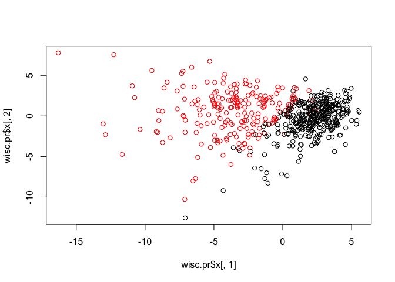
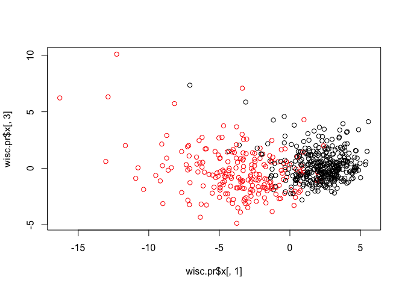
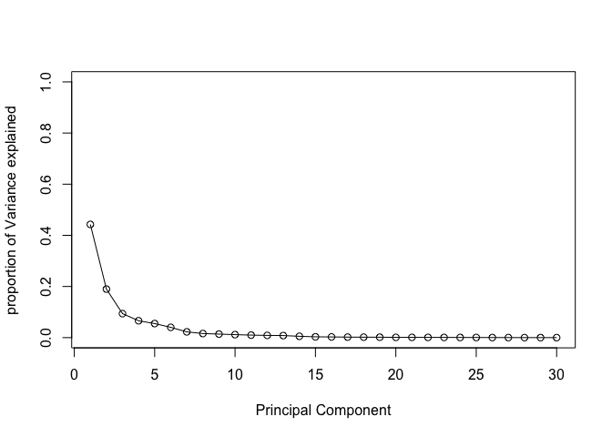
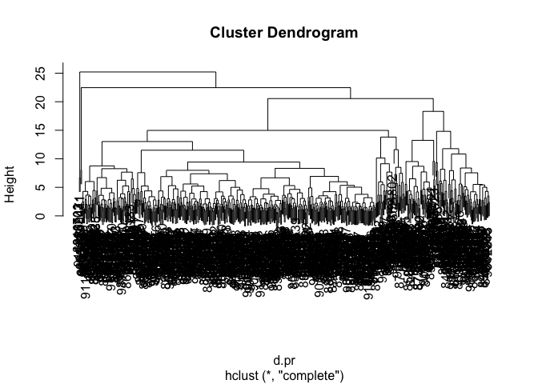
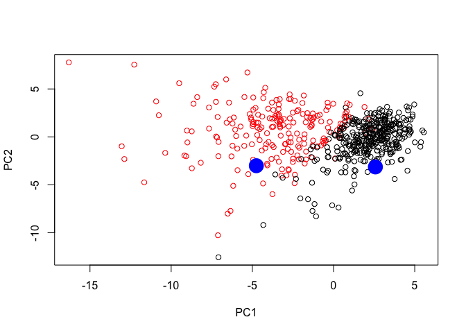

class 9 ws
================
Nicholas Donahue
10/30/2018

Unsupervised Learning Analysis of Cancer Cells
----------------------------------------------

impot data.

``` r
url<-"https://bioboot.github.io/bimm143_S18/class-material/WisconsinCancer.csv"
wisc_df<-read.csv(url)
head(wisc_df)
```

    ##         id diagnosis radius_mean texture_mean perimeter_mean area_mean
    ## 1   842302         M       17.99        10.38         122.80    1001.0
    ## 2   842517         M       20.57        17.77         132.90    1326.0
    ## 3 84300903         M       19.69        21.25         130.00    1203.0
    ## 4 84348301         M       11.42        20.38          77.58     386.1
    ## 5 84358402         M       20.29        14.34         135.10    1297.0
    ## 6   843786         M       12.45        15.70          82.57     477.1
    ##   smoothness_mean compactness_mean concavity_mean concave.points_mean
    ## 1         0.11840          0.27760         0.3001             0.14710
    ## 2         0.08474          0.07864         0.0869             0.07017
    ## 3         0.10960          0.15990         0.1974             0.12790
    ## 4         0.14250          0.28390         0.2414             0.10520
    ## 5         0.10030          0.13280         0.1980             0.10430
    ## 6         0.12780          0.17000         0.1578             0.08089
    ##   symmetry_mean fractal_dimension_mean radius_se texture_se perimeter_se
    ## 1        0.2419                0.07871    1.0950     0.9053        8.589
    ## 2        0.1812                0.05667    0.5435     0.7339        3.398
    ## 3        0.2069                0.05999    0.7456     0.7869        4.585
    ## 4        0.2597                0.09744    0.4956     1.1560        3.445
    ## 5        0.1809                0.05883    0.7572     0.7813        5.438
    ## 6        0.2087                0.07613    0.3345     0.8902        2.217
    ##   area_se smoothness_se compactness_se concavity_se concave.points_se
    ## 1  153.40      0.006399        0.04904      0.05373           0.01587
    ## 2   74.08      0.005225        0.01308      0.01860           0.01340
    ## 3   94.03      0.006150        0.04006      0.03832           0.02058
    ## 4   27.23      0.009110        0.07458      0.05661           0.01867
    ## 5   94.44      0.011490        0.02461      0.05688           0.01885
    ## 6   27.19      0.007510        0.03345      0.03672           0.01137
    ##   symmetry_se fractal_dimension_se radius_worst texture_worst
    ## 1     0.03003             0.006193        25.38         17.33
    ## 2     0.01389             0.003532        24.99         23.41
    ## 3     0.02250             0.004571        23.57         25.53
    ## 4     0.05963             0.009208        14.91         26.50
    ## 5     0.01756             0.005115        22.54         16.67
    ## 6     0.02165             0.005082        15.47         23.75
    ##   perimeter_worst area_worst smoothness_worst compactness_worst
    ## 1          184.60     2019.0           0.1622            0.6656
    ## 2          158.80     1956.0           0.1238            0.1866
    ## 3          152.50     1709.0           0.1444            0.4245
    ## 4           98.87      567.7           0.2098            0.8663
    ## 5          152.20     1575.0           0.1374            0.2050
    ## 6          103.40      741.6           0.1791            0.5249
    ##   concavity_worst concave.points_worst symmetry_worst
    ## 1          0.7119               0.2654         0.4601
    ## 2          0.2416               0.1860         0.2750
    ## 3          0.4504               0.2430         0.3613
    ## 4          0.6869               0.2575         0.6638
    ## 5          0.4000               0.1625         0.2364
    ## 6          0.5355               0.1741         0.3985
    ##   fractal_dimension_worst  X
    ## 1                 0.11890 NA
    ## 2                 0.08902 NA
    ## 3                 0.08758 NA
    ## 4                 0.17300 NA
    ## 5                 0.07678 NA
    ## 6                 0.12440 NA

``` r
nrow(wisc_df)
```

    ## [1] 569

``` r
#count number of malignant and benign tumors
table(wisc_df$diagnosis)
```

    ## 
    ##   B   M 
    ## 357 212

``` r
as.numeric(wisc_df$diagnosis=="M")
```

    ##   [1] 1 1 1 1 1 1 1 1 1 1 1 1 1 1 1 1 1 1 1 0 0 0 1 1 1 1 1 1 1 1 1 1 1 1 1
    ##  [36] 1 1 0 1 1 1 1 1 1 1 1 0 1 0 0 0 0 0 1 1 0 1 1 0 0 0 0 1 0 1 1 0 0 0 0
    ##  [71] 1 0 1 1 0 1 0 1 1 0 0 0 1 1 0 1 1 1 0 0 0 1 0 0 1 1 0 0 0 1 1 0 0 0 0
    ## [106] 1 0 0 1 0 0 0 0 0 0 0 0 1 1 1 0 1 1 0 0 0 1 1 0 1 0 1 1 0 1 1 0 0 1 0
    ## [141] 0 1 0 0 0 0 1 0 0 0 0 0 0 0 0 0 1 0 0 0 0 1 1 0 1 0 0 1 1 0 0 1 1 0 0
    ## [176] 0 0 1 0 0 1 1 1 0 1 0 1 0 0 0 1 0 0 1 1 0 1 1 1 1 0 1 1 1 0 1 0 1 0 0
    ## [211] 1 0 1 1 1 1 0 0 1 1 0 0 0 1 0 0 0 0 0 1 1 0 0 1 0 0 1 1 0 1 0 0 0 0 1
    ## [246] 0 0 0 0 0 1 0 1 1 1 1 1 1 1 1 1 1 1 1 1 1 0 0 0 0 0 0 1 0 1 0 0 1 0 0
    ## [281] 1 0 1 1 0 0 0 0 0 0 0 0 0 0 0 0 0 1 0 0 1 0 1 0 0 0 0 0 0 0 0 0 0 0 0
    ## [316] 0 0 1 0 0 0 1 0 1 0 0 0 0 1 1 1 0 0 0 0 1 0 1 0 1 0 0 0 1 0 0 0 0 0 0
    ## [351] 0 1 1 1 0 0 0 0 0 0 0 0 0 0 0 1 1 0 1 1 1 0 1 1 0 0 0 0 0 1 0 0 0 0 0
    ## [386] 1 0 0 0 1 0 0 1 1 0 0 0 0 0 0 1 0 0 0 0 0 0 0 1 0 0 0 0 0 1 0 0 1 0 0
    ## [421] 0 0 0 0 0 0 0 0 0 0 1 0 1 1 0 1 0 0 0 0 0 1 0 0 1 0 1 0 0 1 0 1 0 0 0
    ## [456] 0 0 0 0 0 1 1 0 0 0 0 0 0 1 0 0 0 0 0 0 0 0 0 0 1 0 0 0 0 0 0 0 1 0 1
    ## [491] 0 0 1 0 0 0 0 0 1 1 0 1 0 1 0 0 0 0 0 1 0 0 1 0 1 0 1 1 0 0 0 1 0 0 0
    ## [526] 0 0 0 0 0 0 0 0 1 0 1 1 0 0 0 0 0 0 0 0 0 0 0 0 0 0 0 0 0 0 0 0 0 0 0
    ## [561] 0 0 1 1 1 1 1 1 0

Examine input data. convert other columns of data frame to matrix

``` r
wisc.data<-as.matrix(wisc_df[,3:32])
```

counting number of malignant or benign tumors

``` r
diagnosis<-as.numeric(wisc_df$diagnosis=="M")
sum(diagnosis)
```

    ## [1] 212

How many variables/features in the data are suffixed with \_mean? 10 of them

``` r
x<-length(grep("_mean", colnames(wisc.data)))
```

There are are 10 mean measurements in this dataset

``` r
rownames(wisc.data)<-wisc_df$id
```

Secion 2 Performing PCA Check the mean and SD of the features of wisc.data to determine if should be scaled

``` r
colMeans(wisc.data)
```

    ##             radius_mean            texture_mean          perimeter_mean 
    ##            1.412729e+01            1.928965e+01            9.196903e+01 
    ##               area_mean         smoothness_mean        compactness_mean 
    ##            6.548891e+02            9.636028e-02            1.043410e-01 
    ##          concavity_mean     concave.points_mean           symmetry_mean 
    ##            8.879932e-02            4.891915e-02            1.811619e-01 
    ##  fractal_dimension_mean               radius_se              texture_se 
    ##            6.279761e-02            4.051721e-01            1.216853e+00 
    ##            perimeter_se                 area_se           smoothness_se 
    ##            2.866059e+00            4.033708e+01            7.040979e-03 
    ##          compactness_se            concavity_se       concave.points_se 
    ##            2.547814e-02            3.189372e-02            1.179614e-02 
    ##             symmetry_se    fractal_dimension_se            radius_worst 
    ##            2.054230e-02            3.794904e-03            1.626919e+01 
    ##           texture_worst         perimeter_worst              area_worst 
    ##            2.567722e+01            1.072612e+02            8.805831e+02 
    ##        smoothness_worst       compactness_worst         concavity_worst 
    ##            1.323686e-01            2.542650e-01            2.721885e-01 
    ##    concave.points_worst          symmetry_worst fractal_dimension_worst 
    ##            1.146062e-01            2.900756e-01            8.394582e-02

``` r
apply(wisc.data, 2, sd)
```

    ##             radius_mean            texture_mean          perimeter_mean 
    ##            3.524049e+00            4.301036e+00            2.429898e+01 
    ##               area_mean         smoothness_mean        compactness_mean 
    ##            3.519141e+02            1.406413e-02            5.281276e-02 
    ##          concavity_mean     concave.points_mean           symmetry_mean 
    ##            7.971981e-02            3.880284e-02            2.741428e-02 
    ##  fractal_dimension_mean               radius_se              texture_se 
    ##            7.060363e-03            2.773127e-01            5.516484e-01 
    ##            perimeter_se                 area_se           smoothness_se 
    ##            2.021855e+00            4.549101e+01            3.002518e-03 
    ##          compactness_se            concavity_se       concave.points_se 
    ##            1.790818e-02            3.018606e-02            6.170285e-03 
    ##             symmetry_se    fractal_dimension_se            radius_worst 
    ##            8.266372e-03            2.646071e-03            4.833242e+00 
    ##           texture_worst         perimeter_worst              area_worst 
    ##            6.146258e+00            3.360254e+01            5.693570e+02 
    ##        smoothness_worst       compactness_worst         concavity_worst 
    ##            2.283243e-02            1.573365e-01            2.086243e-01 
    ##    concave.points_worst          symmetry_worst fractal_dimension_worst 
    ##            6.573234e-02            6.186747e-02            1.806127e-02

``` r
#perform PCA on wisc.data
wisc.pr<-prcomp(wisc.data, scale=TRUE)
summary(wisc.pr)
```

    ## Importance of components:
    ##                           PC1    PC2     PC3     PC4     PC5     PC6
    ## Standard deviation     3.6444 2.3857 1.67867 1.40735 1.28403 1.09880
    ## Proportion of Variance 0.4427 0.1897 0.09393 0.06602 0.05496 0.04025
    ## Cumulative Proportion  0.4427 0.6324 0.72636 0.79239 0.84734 0.88759
    ##                            PC7     PC8    PC9    PC10   PC11    PC12
    ## Standard deviation     0.82172 0.69037 0.6457 0.59219 0.5421 0.51104
    ## Proportion of Variance 0.02251 0.01589 0.0139 0.01169 0.0098 0.00871
    ## Cumulative Proportion  0.91010 0.92598 0.9399 0.95157 0.9614 0.97007
    ##                           PC13    PC14    PC15    PC16    PC17    PC18
    ## Standard deviation     0.49128 0.39624 0.30681 0.28260 0.24372 0.22939
    ## Proportion of Variance 0.00805 0.00523 0.00314 0.00266 0.00198 0.00175
    ## Cumulative Proportion  0.97812 0.98335 0.98649 0.98915 0.99113 0.99288
    ##                           PC19    PC20   PC21    PC22    PC23   PC24
    ## Standard deviation     0.22244 0.17652 0.1731 0.16565 0.15602 0.1344
    ## Proportion of Variance 0.00165 0.00104 0.0010 0.00091 0.00081 0.0006
    ## Cumulative Proportion  0.99453 0.99557 0.9966 0.99749 0.99830 0.9989
    ##                           PC25    PC26    PC27    PC28    PC29    PC30
    ## Standard deviation     0.12442 0.09043 0.08307 0.03987 0.02736 0.01153
    ## Proportion of Variance 0.00052 0.00027 0.00023 0.00005 0.00002 0.00000
    ## Cumulative Proportion  0.99942 0.99969 0.99992 0.99997 1.00000 1.00000

Making a plot of PC1 vs PC2

``` r
biplot(wisc.pr)
```

 hard to understand. going to need a different plot

``` r
attributes(wisc.pr)
```

    ## $names
    ## [1] "sdev"     "rotation" "center"   "scale"    "x"       
    ## 
    ## $class
    ## [1] "prcomp"

``` r
dim(wisc.pr$x)
```

    ## [1] 569  30

``` r
plot(wisc.pr$x[,1], wisc.pr$x[,2])
```


``` r
plot(wisc.pr$x[,1], wisc.pr$x[,2], col=diagnosis+1)
```



plot principal components 1 and 3

``` r
plot(wisc.pr$x[,1], wisc.pr$x[,3], col=diagnosis+1)
```

 Overall plots indicate that principal component 1 is capturing sep of malignant from benign samples.

Variance Explained

``` r
pr.var<-wisc.pr$sdev^2
pr.var
```

    ##  [1] 1.328161e+01 5.691355e+00 2.817949e+00 1.980640e+00 1.648731e+00
    ##  [6] 1.207357e+00 6.752201e-01 4.766171e-01 4.168948e-01 3.506935e-01
    ## [11] 2.939157e-01 2.611614e-01 2.413575e-01 1.570097e-01 9.413497e-02
    ## [16] 7.986280e-02 5.939904e-02 5.261878e-02 4.947759e-02 3.115940e-02
    ## [21] 2.997289e-02 2.743940e-02 2.434084e-02 1.805501e-02 1.548127e-02
    ## [26] 8.177640e-03 6.900464e-03 1.589338e-03 7.488031e-04 1.330448e-04

dividing

``` r
pve<-pr.var/sum(pr.var)
pve
```

    ##  [1] 4.427203e-01 1.897118e-01 9.393163e-02 6.602135e-02 5.495768e-02
    ##  [6] 4.024522e-02 2.250734e-02 1.588724e-02 1.389649e-02 1.168978e-02
    ## [11] 9.797190e-03 8.705379e-03 8.045250e-03 5.233657e-03 3.137832e-03
    ## [16] 2.662093e-03 1.979968e-03 1.753959e-03 1.649253e-03 1.038647e-03
    ## [21] 9.990965e-04 9.146468e-04 8.113613e-04 6.018336e-04 5.160424e-04
    ## [26] 2.725880e-04 2.300155e-04 5.297793e-05 2.496010e-05 4.434827e-06

Plotting scree plot

``` r
plot(pve, xlab = "Principal Component", ylab="proportion of Variance explained", ylim=c(0, 1), type="o")
```

 Barplot

``` r
percentpve<-pve*100
barplot(pve, ylab = "Precent of Variance Explained",
     names.arg=paste0("PC",1:length(pve)), las=2, axes = FALSE)
axis(2, at=pve, labels=round(pve,2)*100 )
```


``` r
plot(cumsum(pve), xlab = "Principal Component", 
     ylab = "Cumulative Proportion of Variance Explained", 
     ylim = c(0, 1), type = "o")
```


Section 3 Hierarchical Clustering

``` r
data.scaled<-scale(wisc.data)
```

``` r
data.dist<-dist(data.scaled)
```

Create hierarchical clustering model

``` r
wisc.hclust<-hclust(data.dist, method="complete")
plot(wisc.hclust)
```

 Use cutree() to cut tree so that it has 4 clusters

``` r
plot(wisc.hclust)
```


``` r
wisc.hclust.clusters<-cutree(wisc.hclust, k=4)
table(wisc.hclust.clusters)
```

    ## wisc.hclust.clusters
    ##   1   2   3   4 
    ## 177   7 383   2

Compare cluster groups to show diagnosis

``` r
table(wisc.hclust.clusters, diagnosis)
```

    ##                     diagnosis
    ## wisc.hclust.clusters   0   1
    ##                    1  12 165
    ##                    2   2   5
    ##                    3 343  40
    ##                    4   0   2

Trying to find a better diagnosis

``` r
wisc.hclust.clusters6<-cutree(wisc.hclust, k=10)
table(wisc.hclust.clusters6, diagnosis)
```

    ##                      diagnosis
    ## wisc.hclust.clusters6   0   1
    ##                    1   12  86
    ##                    2    0  59
    ##                    3    0   3
    ##                    4  331  39
    ##                    5    0  20
    ##                    6    2   0
    ##                    7   12   0
    ##                    8    0   2
    ##                    9    0   2
    ##                    10   0   1

Section 5: CLustering on PCA Results

``` r
## Use the distance along the first 7 PCs for clustering i.e. wisc.pr$x[, 1:7]
d.pr<-dist(wisc.pr$x[,1:7])
wisc.pr.hclust<-hclust(d.pr, method="complete")
plot(wisc.pr.hclust)
```

 Cut this hierarchical clustering model into 4 clusters and assign the results to wisc.pr.hclust.clusters.

``` r
wisc.pr.hclust.clusters<-cutree(wisc.pr.hclust, k=4)
table(wisc.pr.hclust.clusters)
```

    ## wisc.pr.hclust.clusters
    ##   1   2   3   4 
    ## 118 447   2   2

Using table(), compare the results from your new hierarchical clustering model with the actual diagnoses.

``` r
table(wisc.pr.hclust.clusters, diagnosis)
```

    ##                        diagnosis
    ## wisc.pr.hclust.clusters   0   1
    ##                       1   5 113
    ##                       2 350  97
    ##                       3   2   0
    ##                       4   0   2

bonus: predictive modeling with PCA Components
----------------------------------------------

Take new patient data and apply PCA model from above

``` r
## Predicting Malignancy Of New samples
url <- "https://tinyurl.com/new-samples-CSV"
new <- read.csv(url)
npc <- predict(wisc.pr, newdata=new)
plot(wisc.pr$x[,1:2], col=diagnosis+1)
points(npc[,1], npc[,2], col="blue", pch=16, cex=3)
```


